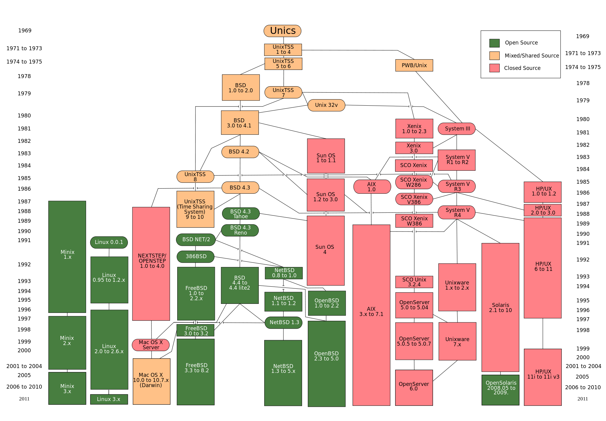
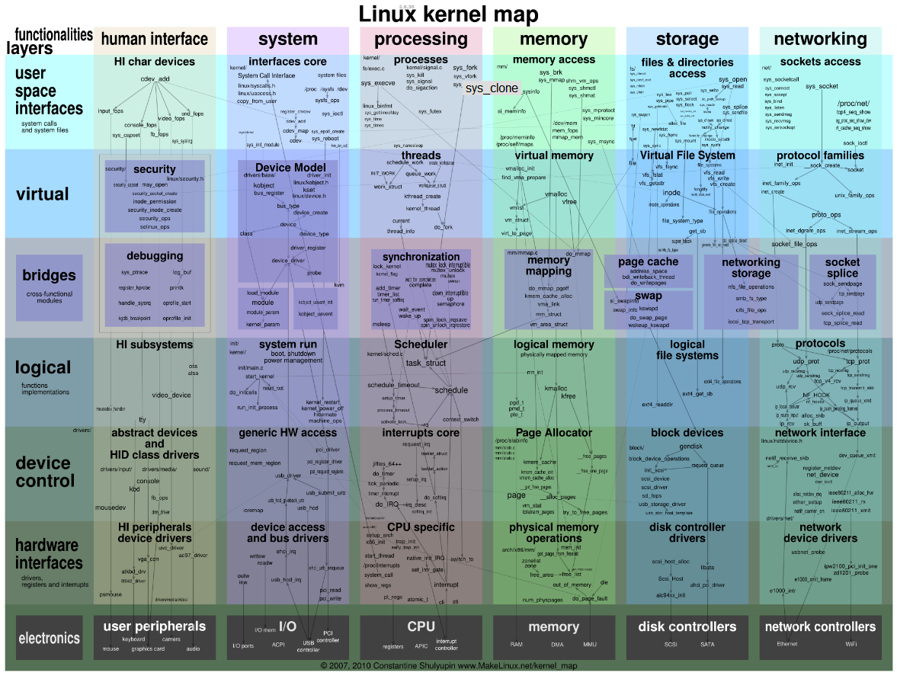
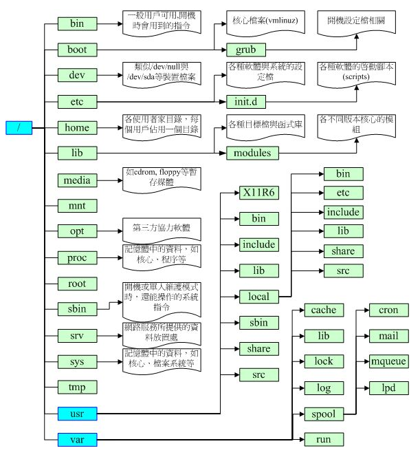
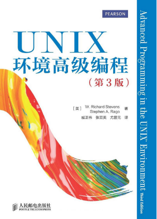

# Linux/UNIX 环境高级编程学习笔记

本仓库已经开始作为GitBook仓库，访问地址

<https://yifengyou.gitbooks.io/unix_programming_manual/content/>

GitHub访问地址

<https://github.com/yifengyou/UNIX_Programming_Manual>

```
Something I hope you know before go into the coding~
First, please watch or star this repo, I'll be more happy if you follow me.
Bug report, questions and discussion are welcome, you can post an issue or pull a request.
```








## 参考书目

> 《UNIX环境高级编程（第3版）》




《UNIX环境高级编程（第3版）》是被誉为UNIX编程“圣经”的Advanced Programming in the UNIX Environment一书的第3版。在本书第2版出版后的8年中，UNIX行业发生了巨大的变化，特别是影响UNIX编程接口的有关标准变化很大。本书在保持前一版风格的基础上，根据最新的标准对内容进行了修订和增补，反映了最新的技术发展。书中除了介绍UNIX文件和目录、标准I/O库、系统数据文件和信息、进程环境、进程控制、进程关系、信号、线程、线程控制、守护进程、各种I/O、进程间通信、网络IPC、伪终端等方面的内容，还在此基础上介绍了众多应用实例，包括如何创建数据库函数库以及如何与网络打印机通信等。此外，还在附录中给出了函数原型和部分习题的答案。

《UNIX环境高级编程（第3版）》内容权威，概念清晰，阐述精辟，对于所有层次UNIX/Linux程序员都是一本不可或缺的参考书。

> 《linux/unix系统编程手册(上、下册)》


《linux/unix系统编程手册(上、下册)》是介绍linux与unix编程接口的权威著作。linux编程资深专家michael kerrisk在书中详细描述了linux/unix系统编程所涉及的系统调用和库函数，并辅之以全面而清晰的代码示例。《linux/unix系统编程手册(上、下册)》涵盖了逾500个系统调用及库函数，并给出逾200个程序示例，另含88张表格和115幅示意图。

《linux/unix系统编程手册(上、下册)》总共分为64章，主要讲解了高效读写文件，对信号、时钟和定时器的运用，创建进程、执行程序，编写安全的应用程序，运用posix线程技术编写多线程程序，创建和使用共享库，运用管道、消息队列、共享内存和信号量技术来进行进程间通信，以及运用套接字api编写网络应用等内容。

《linux/unix系统编程手册(上、下册)》在汇聚大批 linux专有特性(epoll、inotify、/proc)的同时，还特意强化了对unix标准(posix、sus)的论述，彻底达到了“鱼与熊掌，二者得兼”的效果，这也堪称本书的最大亮点。

《linux/unix系统编程手册(上、下册)》布局合理，论述清晰，说理透彻，尤其是作者对示例代码的构思巧妙，独具匠心，仔细研读定会受益良多。本书适合从事linux/unix系统开发、运维工作的技术人员阅读，同时也可作为高校计算机专业学生的参考研习资料。

## 注意事项

1. 源码不要再Windows端解压，会破坏软链接造成编译失败等问题。
2. 论实践的重要性
