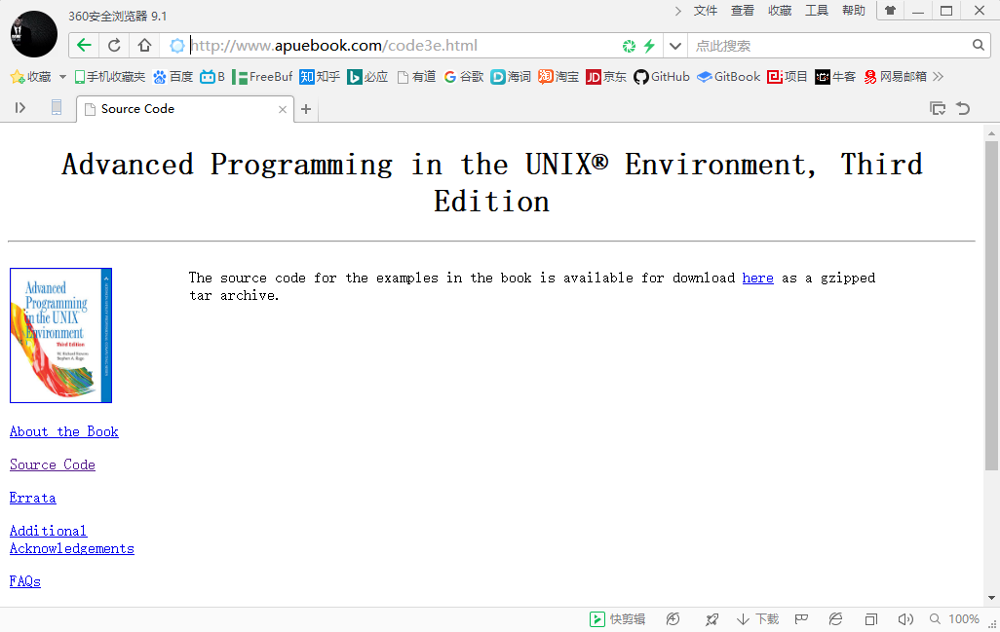
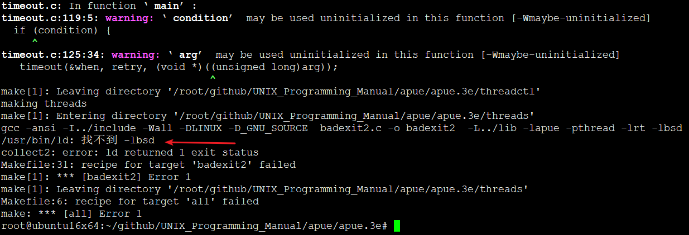
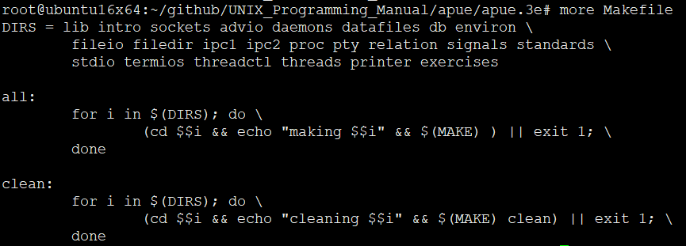
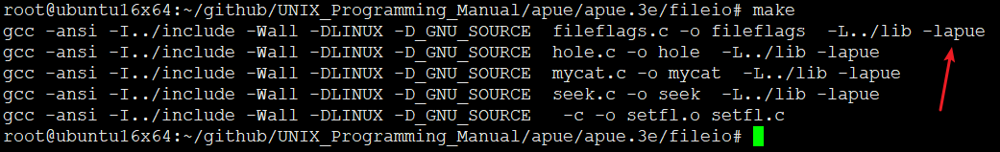

<!-- TOC depthFrom:1 depthTo:6 withLinks:1 updateOnSave:1 orderedList:0 -->

- [APUE环境搭建](#apue环境搭建)
	- [官方网址](#官方网址)
	- [常见问题解决](#常见问题解决)
	- [编译过程](#编译过程)
	- [后续操作](#后续操作)
	- [Makefile](#makefile)
	- [库文件使用](#库文件使用)
	- [END](#end)

<!-- /TOC -->

# APUE环境搭建


## 官方网址

APUE：<http://www.apuebook.com/code3e.html>




## 常见问题解决




```
root@ubuntu16x64:~/github/UNIX_Programming_Manual/apue/apue.3e# apt-get install libbsd-dev  
正在读取软件包列表... 完成
正在分析软件包的依赖关系树       
正在读取状态信息... 完成       
下列【新】软件包将被安装：
  libbsd-dev
升级了 0 个软件包，新安装了 1 个软件包，要卸载 0 个软件包，有 52 个软件包未被升级。
需要下载 134 kB 的归档。
解压缩后会消耗 471 kB 的额外空间。
获取:1 http://mirrors.aliyun.com/ubuntu xenial/main amd64 libbsd-dev amd64 0.8.2-1 [134 kB]
已下载 134 kB，耗时 0秒 (249 kB/s)
正在选中未选择的软件包 libbsd-dev:amd64。
(正在读取数据库 ... 系统当前共安装有 263410 个文件和目录。)
正准备解包 .../libbsd-dev_0.8.2-1_amd64.deb  ...
正在解包 libbsd-dev:amd64 (0.8.2-1) ...
正在处理用于 man-db (2.7.5-1) 的触发器 ...
正在设置 libbsd-dev:amd64 (0.8.2-1) ...
```

## 编译过程

```
root@ubuntu16x64:~/github/UNIX_Programming_Manual/apue/apue.3e# make
for i in lib intro sockets advio daemons datafiles db environ fileio filedir ipc1 ipc2 proc pty relation signals standards stdio termios threadctl threads printer exercises; do \
	(cd $i && echo "making $i" && make ) || exit 1; \
done
making lib
make[1]: Entering directory '/root/github/UNIX_Programming_Manual/apue/apue.3e/lib'
gcc -ansi -I../include -Wall -DLINUX -D_GNU_SOURCE   -c -o bufargs.o bufargs.c
gcc -ansi -I../include -Wall -DLINUX -D_GNU_SOURCE   -c -o cliconn.o cliconn.c
gcc -ansi -I../include -Wall -DLINUX -D_GNU_SOURCE   -c -o clrfl.o clrfl.c
gcc -ansi -I../include -Wall -DLINUX -D_GNU_SOURCE   -c -o daemonize.o daemonize.c
gcc -ansi -I../include -Wall -DLINUX -D_GNU_SOURCE   -c -o error.o error.c
gcc -ansi -I../include -Wall -DLINUX -D_GNU_SOURCE   -c -o errorlog.o errorlog.c
gcc -ansi -I../include -Wall -DLINUX -D_GNU_SOURCE   -c -o lockreg.o lockreg.c
gcc -ansi -I../include -Wall -DLINUX -D_GNU_SOURCE   -c -o locktest.o locktest.c
gcc -ansi -I../include -Wall -DLINUX -D_GNU_SOURCE   -c -o openmax.o openmax.c
gcc -ansi -I../include -Wall -DLINUX -D_GNU_SOURCE   -c -o pathalloc.o pathalloc.c
gcc -ansi -I../include -Wall -DLINUX -D_GNU_SOURCE   -c -o popen.o popen.c
gcc -ansi -I../include -Wall -DLINUX -D_GNU_SOURCE   -c -o prexit.o prexit.c
gcc -ansi -I../include -Wall -DLINUX -D_GNU_SOURCE   -c -o prmask.o prmask.c
gcc -ansi -I../include -Wall -DLINUX -D_GNU_SOURCE   -c -o ptyfork.o ptyfork.c
gcc -ansi -I../include -Wall -DLINUX -D_GNU_SOURCE   -c -o ptyopen.o ptyopen.c
gcc -ansi -I../include -Wall -DLINUX -D_GNU_SOURCE   -c -o readn.o readn.c
gcc -ansi -I../include -Wall -DLINUX -D_GNU_SOURCE   -c -o recvfd.o recvfd.c
gcc -ansi -I../include -Wall -DLINUX -D_GNU_SOURCE   -c -o senderr.o senderr.c
gcc -ansi -I../include -Wall -DLINUX -D_GNU_SOURCE   -c -o sendfd.o sendfd.c
gcc -ansi -I../include -Wall -DLINUX -D_GNU_SOURCE   -c -o servaccept.o servaccept.c
gcc -ansi -I../include -Wall -DLINUX -D_GNU_SOURCE   -c -o servlisten.o servlisten.c
gcc -ansi -I../include -Wall -DLINUX -D_GNU_SOURCE   -c -o setfd.o setfd.c
gcc -ansi -I../include -Wall -DLINUX -D_GNU_SOURCE   -c -o setfl.o setfl.c
gcc -ansi -I../include -Wall -DLINUX -D_GNU_SOURCE   -c -o signal.o signal.c
gcc -ansi -I../include -Wall -DLINUX -D_GNU_SOURCE   -c -o signalintr.o signalintr.c
gcc -ansi -I../include -Wall -DLINUX -D_GNU_SOURCE   -c -o sleepus.o sleepus.c
gcc -ansi -I../include -Wall -DLINUX -D_GNU_SOURCE   -c -o spipe.o spipe.c
gcc -ansi -I../include -Wall -DLINUX -D_GNU_SOURCE   -c -o tellwait.o tellwait.c
gcc -ansi -I../include -Wall -DLINUX -D_GNU_SOURCE   -c -o ttymodes.o ttymodes.c
gcc -ansi -I../include -Wall -DLINUX -D_GNU_SOURCE   -c -o writen.o writen.c
ar rv libapue.a bufargs.o cliconn.o clrfl.o daemonize.o error.o errorlog.o lockreg.o locktest.o openmax.o pathalloc.o popen.o prexit.o prmask.o ptyfork.o ptyopen.o readn.o recvfd.o senderr.o sendfd.o servaccept.o servlisten.o setfd.o setfl.o signal.o signalintr.o sleepus.o spipe.o tellwait.o ttymodes.o writen.o
ar: 正在创建 libapue.a
a - bufargs.o
a - cliconn.o
a - clrfl.o
a - daemonize.o
a - error.o
a - errorlog.o
a - lockreg.o
a - locktest.o
a - openmax.o
a - pathalloc.o
a - popen.o
a - prexit.o
a - prmask.o
a - ptyfork.o
a - ptyopen.o
a - readn.o
a - recvfd.o
a - senderr.o
a - sendfd.o
a - servaccept.o
a - servlisten.o
a - setfd.o
a - setfl.o
a - signal.o
a - signalintr.o
a - sleepus.o
a - spipe.o
a - tellwait.o
a - ttymodes.o
a - writen.o
echo libapue.a
libapue.a
gcc -ansi -I../include -Wall -DLINUX -D_GNU_SOURCE   -c -o sleep.o sleep.c
make[1]: Leaving directory '/root/github/UNIX_Programming_Manual/apue/apue.3e/lib'
making intro
make[1]: Entering directory '/root/github/UNIX_Programming_Manual/apue/apue.3e/intro'
gcc -ansi -I../include -Wall -DLINUX -D_GNU_SOURCE  getcputc.c -o getcputc  -L../lib -lapue
gcc -ansi -I../include -Wall -DLINUX -D_GNU_SOURCE  hello.c -o hello  -L../lib -lapue
gcc -ansi -I../include -Wall -DLINUX -D_GNU_SOURCE  ls1.c -o ls1  -L../lib -lapue
gcc -ansi -I../include -Wall -DLINUX -D_GNU_SOURCE  mycat.c -o mycat  -L../lib -lapue
gcc -ansi -I../include -Wall -DLINUX -D_GNU_SOURCE  shell1.c -o shell1  -L../lib -lapue
gcc -ansi -I../include -Wall -DLINUX -D_GNU_SOURCE  shell2.c -o shell2  -L../lib -lapue
gcc -ansi -I../include -Wall -DLINUX -D_GNU_SOURCE  testerror.c -o testerror  -L../lib -lapue
gcc -ansi -I../include -Wall -DLINUX -D_GNU_SOURCE  uidgid.c -o uidgid  -L../lib -lapue
make[1]: Leaving directory '/root/github/UNIX_Programming_Manual/apue/apue.3e/intro'
making sockets
make[1]: Entering directory '/root/github/UNIX_Programming_Manual/apue/apue.3e/sockets'
gcc -ansi -I../include -Wall -DLINUX -D_GNU_SOURCE   -c -o ruptime.o ruptime.c
gcc -ansi -I../include -Wall -DLINUX -D_GNU_SOURCE   -c -o clconn2.o clconn2.c
gcc -ansi -I../include -Wall -DLINUX -D_GNU_SOURCE  -o ruptime ruptime.o clconn2.o  -L../lib -lapue
gcc -ansi -I../include -Wall -DLINUX -D_GNU_SOURCE   -c -o ruptimed.o ruptimed.c
gcc -ansi -I../include -Wall -DLINUX -D_GNU_SOURCE   -c -o initsrv2.o initsrv2.c
gcc -ansi -I../include -Wall -DLINUX -D_GNU_SOURCE  -o ruptimed ruptimed.o initsrv2.o  -L../lib -lapue
gcc -ansi -I../include -Wall -DLINUX -D_GNU_SOURCE   -c -o ruptimed-fd.o ruptimed-fd.c
gcc -ansi -I../include -Wall -DLINUX -D_GNU_SOURCE  -o ruptimed-fd ruptimed-fd.o initsrv2.o  -L../lib -lapue
gcc -ansi -I../include -Wall -DLINUX -D_GNU_SOURCE   -c -o ruptimed-dg.o ruptimed-dg.c
gcc -ansi -I../include -Wall -DLINUX -D_GNU_SOURCE  -o ruptimed-dg ruptimed-dg.o initsrv2.o  -L../lib -lapue
gcc -ansi -I../include -Wall -DLINUX -D_GNU_SOURCE    findsvc.c  -L../lib -lapue  -o findsvc
gcc -ansi -I../include -Wall -DLINUX -D_GNU_SOURCE    ruptime-dg.c  -L../lib -lapue  -o ruptime-dg
gcc -ansi -I../include -Wall -DLINUX -D_GNU_SOURCE   -c -o clconn.o clconn.c
gcc -ansi -I../include -Wall -DLINUX -D_GNU_SOURCE   -c -o initsrv1.o initsrv1.c
make[1]: Leaving directory '/root/github/UNIX_Programming_Manual/apue/apue.3e/sockets'
making advio
make[1]: Entering directory '/root/github/UNIX_Programming_Manual/apue/apue.3e/advio'
gcc -ansi -I../include -Wall -DLINUX -D_GNU_SOURCE  deadlock.c -o deadlock  -L../lib -lapue -lrt
gcc -ansi -I../include -Wall -DLINUX -D_GNU_SOURCE  mandatory.c -o mandatory  -L../lib -lapue -lrt
gcc -ansi -I../include -Wall -DLINUX -D_GNU_SOURCE  mcopy2.c -o mcopy2  -L../lib -lapue -lrt
gcc -ansi -I../include -Wall -DLINUX -D_GNU_SOURCE  nonblockw.c -o nonblockw  -L../lib -lapue -lrt
gcc -ansi -I../include -Wall -DLINUX -D_GNU_SOURCE  rot13a.c -o rot13a  -L../lib -lapue -lrt
./fixup.awk rot13a.c >xlate
sed '/same/q' rot13c2.c.in >rot13c2.c
cat xlate >>rot13c2.c
sed '1,/same/d' rot13c2.c.in >>rot13c2.c
gcc -ansi -I../include -Wall -DLINUX -D_GNU_SOURCE  rot13c2.c -o rot13c2  -L../lib -lapue -lrt
gcc -ansi -I../include -Wall -DLINUX -D_GNU_SOURCE   -c -o lockfile.o lockfile.c
make[1]: Leaving directory '/root/github/UNIX_Programming_Manual/apue/apue.3e/advio'
making daemons
make[1]: Entering directory '/root/github/UNIX_Programming_Manual/apue/apue.3e/daemons'
gcc -ansi -I../include -Wall -DLINUX -D_GNU_SOURCE   -c -o init.o init.c
gcc -ansi -I../include -Wall -DLINUX -D_GNU_SOURCE   -c -o reread.o reread.c
gcc -ansi -I../include -Wall -DLINUX -D_GNU_SOURCE   -c -o reread2.o reread2.c
gcc -ansi -I../include -Wall -DLINUX -D_GNU_SOURCE   -c -o single.o single.c
make[1]: Leaving directory '/root/github/UNIX_Programming_Manual/apue/apue.3e/daemons'
making datafiles
make[1]: Entering directory '/root/github/UNIX_Programming_Manual/apue/apue.3e/datafiles'
gcc -ansi -I../include -Wall -DLINUX -D_GNU_SOURCE  strftime.c -o strftime  -L../lib -lapue
gcc -ansi -I../include -Wall -DLINUX -D_GNU_SOURCE   -c -o getpwnam.o getpwnam.c
make[1]: Leaving directory '/root/github/UNIX_Programming_Manual/apue/apue.3e/datafiles'
making db
make[1]: Entering directory '/root/github/UNIX_Programming_Manual/apue/apue.3e/db'
gcc -fPIC -ansi -I../include -Wall -DLINUX -D_GNU_SOURCE  -c db.c
gcc -shared -Wl,-dylib -o libapue_db.so.1 -L../lib -lapue -lc db.o
ln -s libapue_db.so.1 libapue_db.so
gcc -ansi -I../include -Wall -DLINUX -D_GNU_SOURCE  -c -I. t4.c
gcc -Wl,-rpath=. -o t4 t4.o -L../lib -L. -lapue_db -lapue
ar rsv libapue_db.a db.o
ar: 正在创建 libapue_db.a
a - db.o
echo libapue_db.a
libapue_db.a
make[1]: Leaving directory '/root/github/UNIX_Programming_Manual/apue/apue.3e/db'
making environ
make[1]: Entering directory '/root/github/UNIX_Programming_Manual/apue/apue.3e/environ'
gcc -ansi -I../include -Wall -DLINUX -D_GNU_SOURCE  doatexit.c -o doatexit  -L../lib -lapue
gcc -ansi -I../include -Wall -DLINUX -D_GNU_SOURCE  echoarg.c -o echoarg  -L../lib -lapue
gcc -ansi -I../include -Wall -DLINUX -D_GNU_SOURCE  getrlimit.c -o getrlimit  -L../lib -lapue
gcc -ansi -I../include -Wall -DLINUX -D_GNU_SOURCE  hello1.c -o hello1  -L../lib -lapue
hello1.c:3:1: warning: return type defaults to ‘int’ [-Wreturn-type]
 main()
 ^
hello1.c: In function ‘main’:
hello1.c:6:1: warning: control reaches end of non-void function [-Wreturn-type]
 }
 ^
gcc -ansi -I../include -Wall -DLINUX -D_GNU_SOURCE  testjmp.c -o testjmp  -L../lib -lapue
gcc -ansi -I../include -Wall -DLINUX -D_GNU_SOURCE   -c -o opendata.o opendata.c
gcc -ansi -I../include -Wall -DLINUX -D_GNU_SOURCE   -c -o scope.o scope.c
make[1]: Leaving directory '/root/github/UNIX_Programming_Manual/apue/apue.3e/environ'
making fileio
make[1]: Entering directory '/root/github/UNIX_Programming_Manual/apue/apue.3e/fileio'
gcc -ansi -I../include -Wall -DLINUX -D_GNU_SOURCE  fileflags.c -o fileflags  -L../lib -lapue
gcc -ansi -I../include -Wall -DLINUX -D_GNU_SOURCE  hole.c -o hole  -L../lib -lapue
gcc -ansi -I../include -Wall -DLINUX -D_GNU_SOURCE  mycat.c -o mycat  -L../lib -lapue
gcc -ansi -I../include -Wall -DLINUX -D_GNU_SOURCE  seek.c -o seek  -L../lib -lapue
gcc -ansi -I../include -Wall -DLINUX -D_GNU_SOURCE   -c -o setfl.o setfl.c
make[1]: Leaving directory '/root/github/UNIX_Programming_Manual/apue/apue.3e/fileio'
making filedir
make[1]: Entering directory '/root/github/UNIX_Programming_Manual/apue/apue.3e/filedir'
gcc -ansi -I../include -Wall -DLINUX -D_GNU_SOURCE  access.c -o access  -L../lib -lapue
gcc -ansi -I../include -Wall -DLINUX -D_GNU_SOURCE  cdpwd.c -o cdpwd  -L../lib -lapue
gcc -ansi -I../include -Wall -DLINUX -D_GNU_SOURCE  changemod.c -o changemod  -L../lib -lapue
gcc -ansi -I../include -Wall -DLINUX -D_GNU_SOURCE  devrdev.c -o devrdev  -L../lib -lapue
gcc -ansi -I../include -Wall -DLINUX -D_GNU_SOURCE  filetype.c -o filetype  -L../lib -lapue
gcc -ansi -I../include -Wall -DLINUX -D_GNU_SOURCE  mycd.c -o mycd  -L../lib -lapue
gcc -ansi -I../include -Wall -DLINUX -D_GNU_SOURCE  umask.c -o umask  -L../lib -lapue
gcc -ansi -I../include -Wall -DLINUX -D_GNU_SOURCE  unlink.c -o unlink  -L../lib -lapue
gcc -ansi -I../include -Wall -DLINUX -D_GNU_SOURCE  zap.c -o zap  -L../lib -lapue
gcc -ansi -I../include -Wall -DLINUX -D_GNU_SOURCE   ftw8.c -o ftw8  -L../lib -lapue
make[1]: Leaving directory '/root/github/UNIX_Programming_Manual/apue/apue.3e/filedir'
making ipc1
make[1]: Entering directory '/root/github/UNIX_Programming_Manual/apue/apue.3e/ipc1'
gcc -ansi -I../include -Wall -DLINUX -D_GNU_SOURCE  add2.c -o add2  -L../lib -lapue
gcc -ansi -I../include -Wall -DLINUX -D_GNU_SOURCE  add2stdio.c -o add2stdio  -L../lib -lapue
gcc -ansi -I../include -Wall -DLINUX -D_GNU_SOURCE  devzero.c -o devzero  -L../lib -lapue
gcc -ansi -I../include -Wall -DLINUX -D_GNU_SOURCE  myuclc.c -o myuclc  -L../lib -lapue
gcc -ansi -I../include -Wall -DLINUX -D_GNU_SOURCE  pipe1.c -o pipe1  -L../lib -lapue
gcc -ansi -I../include -Wall -DLINUX -D_GNU_SOURCE  pipe2.c -o pipe2  -L../lib -lapue
gcc -ansi -I../include -Wall -DLINUX -D_GNU_SOURCE  pipe4.c -o pipe4  -L../lib -lapue
gcc -ansi -I../include -Wall -DLINUX -D_GNU_SOURCE  popen1.c -o popen1  -L../lib -lapue
gcc -ansi -I../include -Wall -DLINUX -D_GNU_SOURCE  popen2.c -o popen2  -L../lib -lapue
gcc -ansi -I../include -Wall -DLINUX -D_GNU_SOURCE  tshm.c -o tshm  -L../lib -lapue
gcc -ansi -I../include -Wall -DLINUX -D_GNU_SOURCE   -c -o popen.o popen.c
gcc -ansi -I../include -Wall -DLINUX -D_GNU_SOURCE   -c -o slock.o slock.c
gcc -ansi -I../include -Wall -DLINUX -D_GNU_SOURCE   -c -o tellwait.o tellwait.c
make[1]: Leaving directory '/root/github/UNIX_Programming_Manual/apue/apue.3e/ipc1'
making ipc2
make[1]: Entering directory '/root/github/UNIX_Programming_Manual/apue/apue.3e/ipc2'
gcc -ansi -I../include -Wall -DLINUX -D_GNU_SOURCE  bindunix.c -o bindunix  -L../lib -lapue -pthread
gcc -ansi -I../include -Wall -DLINUX -D_GNU_SOURCE  pollmsg.c -o pollmsg  -L../lib -lapue -pthread
gcc -ansi -I../include -Wall -DLINUX -D_GNU_SOURCE  sendmsg.c -o sendmsg  -L../lib -lapue -pthread
gcc -ansi -I../include -Wall -DLINUX -D_GNU_SOURCE   -c -o recvfd2.o recvfd2.c
gcc -ansi -I../include -Wall -DLINUX -D_GNU_SOURCE   -c -o sendfd2.o sendfd2.c
for i in open opend open.fe opend.fe; do \
	(cd $i && make ) || exit 1; \
done
make[2]: Entering directory '/root/github/UNIX_Programming_Manual/apue/apue.3e/ipc2/open'
gcc -ansi -I../../include -Wall -DLINUX -D_GNU_SOURCE   -c -o main.o main.c
gcc -ansi -I../../include -Wall -DLINUX -D_GNU_SOURCE   -c -o open.o open.c
gcc -ansi -I../../include -Wall -DLINUX -D_GNU_SOURCE  -o openclient main.o open.o  -L../../lib -lapue
make[2]: Leaving directory '/root/github/UNIX_Programming_Manual/apue/apue.3e/ipc2/open'
make[2]: Entering directory '/root/github/UNIX_Programming_Manual/apue/apue.3e/ipc2/opend'
gcc -ansi -I../../include -Wall -DLINUX -D_GNU_SOURCE   -c -o main.o main.c
main.c: In function ‘main’:
main.c:32:1: warning: control reaches end of non-void function [-Wreturn-type]
 }
 ^
gcc -ansi -I../../include -Wall -DLINUX -D_GNU_SOURCE   -c -o request.o request.c
gcc -ansi -I../../include -Wall -DLINUX -D_GNU_SOURCE   -c -o cliargs.o cliargs.c
gcc -ansi -I../../include -Wall -DLINUX -D_GNU_SOURCE   -c -o client.o client.c
gcc -ansi -I../../include -Wall -DLINUX -D_GNU_SOURCE   -c -o loop.poll.o loop.poll.c
gcc -ansi -I../../include -Wall -DLINUX -D_GNU_SOURCE  -o opend.poll main.o cliargs.o client.o request.o loop.poll.o \
	 -L../../lib -lapue
gcc -ansi -I../../include -Wall -DLINUX -D_GNU_SOURCE   -c -o loop.select.o loop.select.c
gcc -ansi -I../../include -Wall -DLINUX -D_GNU_SOURCE  -o opend.select main.o cliargs.o client.o request.o loop.select.o \
	 -L../../lib -lapue
make[2]: Leaving directory '/root/github/UNIX_Programming_Manual/apue/apue.3e/ipc2/opend'
make[2]: Entering directory '/root/github/UNIX_Programming_Manual/apue/apue.3e/ipc2/open.fe'
gcc -ansi -I../../include -Wall -DLINUX -D_GNU_SOURCE   -c -o main.o main.c
gcc -ansi -I../../include -Wall -DLINUX -D_GNU_SOURCE   -c -o open.o open.c
gcc -ansi -I../../include -Wall -DLINUX -D_GNU_SOURCE  -o openclient main.o open.o  -L../../lib -lapue
make[2]: Leaving directory '/root/github/UNIX_Programming_Manual/apue/apue.3e/ipc2/open.fe'
make[2]: Entering directory '/root/github/UNIX_Programming_Manual/apue/apue.3e/ipc2/opend.fe'
gcc -ansi -I../../include -Wall -DLINUX -D_GNU_SOURCE   -c -o main.o main.c
gcc -ansi -I../../include -Wall -DLINUX -D_GNU_SOURCE   -c -o request.o request.c
gcc -ansi -I../../include -Wall -DLINUX -D_GNU_SOURCE   -c -o cliargs.o cliargs.c
gcc -ansi -I../../include -Wall -DLINUX -D_GNU_SOURCE  -o opend main.o cliargs.o request.o  -L../../lib -lapue
make[2]: Leaving directory '/root/github/UNIX_Programming_Manual/apue/apue.3e/ipc2/opend.fe'
make[1]: Leaving directory '/root/github/UNIX_Programming_Manual/apue/apue.3e/ipc2'
making proc
make[1]: Entering directory '/root/github/UNIX_Programming_Manual/apue/apue.3e/proc'
gcc -ansi -I../include -Wall -DLINUX -D_GNU_SOURCE  echoall.c -o echoall  -L../lib -lapue
gcc -ansi -I../include -Wall -DLINUX -D_GNU_SOURCE  exec1.c -o exec1  -L../lib -lapue
gcc -ansi -I../include -Wall -DLINUX -D_GNU_SOURCE  exec2.c -o exec2  -L../lib -lapue
gcc -ansi -I../include -Wall -DLINUX -D_GNU_SOURCE  fork1.c -o fork1  -L../lib -lapue
gcc -ansi -I../include -Wall -DLINUX -D_GNU_SOURCE  fork2.c -o fork2  -L../lib -lapue
gcc -ansi -I../include -Wall -DLINUX -D_GNU_SOURCE  nice.c -o nice  -L../lib -lapue
gcc -ansi -I../include -Wall -DLINUX -D_GNU_SOURCE  pruids.c -o pruids  -L../lib -lapue
gcc -ansi -I../include -Wall -DLINUX -D_GNU_SOURCE  tellwait1.c -o tellwait1  -L../lib -lapue
gcc -ansi -I../include -Wall -DLINUX -D_GNU_SOURCE  tellwait2.c -o tellwait2  -L../lib -lapue
gcc -ansi -I../include -Wall -DLINUX -D_GNU_SOURCE  test1.c -o test1  -L../lib -lapue
gcc -ansi -I../include -Wall -DLINUX -D_GNU_SOURCE  times1.c -o times1  -L../lib -lapue
gcc -ansi -I../include -Wall -DLINUX -D_GNU_SOURCE  vfork1.c -o vfork1  -L../lib -lapue
gcc -ansi -I../include -Wall -DLINUX -D_GNU_SOURCE  wait1.c -o wait1  -L../lib -lapue
wait1.c: In function ‘main’:
wait1.c:31:10: warning: division by zero [-Wdiv-by-zero]
   status /= 0;    /* divide by 0 generates SIGFPE */
          ^
gcc -ansi -I../include -Wall -DLINUX -D_GNU_SOURCE   -c -o system.o system.c
gcc -ansi -I../include -Wall -DLINUX -D_GNU_SOURCE   -c -o systest1.o systest1.c
gcc -ansi -I../include -Wall -DLINUX -D_GNU_SOURCE  -o systest1 systest1.o system.o  -L../lib -lapue
gcc -ansi -I../include -Wall -DLINUX -D_GNU_SOURCE   -c -o systest3.o systest3.c
gcc -ansi -I../include -Wall -DLINUX -D_GNU_SOURCE  -o systest3 systest3.o system.o  -L../lib -lapue
gcc -ansi -I../include -Wall -DLINUX -D_GNU_SOURCE  -DHAS_AXSIG -DHAS_ACORE -o pracct pracct.c  -L../lib -lapue
make[1]: Leaving directory '/root/github/UNIX_Programming_Manual/apue/apue.3e/proc'
making pty
make[1]: Entering directory '/root/github/UNIX_Programming_Manual/apue/apue.3e/pty'
gcc -ansi -I../include -Wall -DLINUX -D_GNU_SOURCE   -c -o main.o main.c
gcc -ansi -I../include -Wall -DLINUX -D_GNU_SOURCE   -c -o loop.o loop.c
gcc -ansi -I../include -Wall -DLINUX -D_GNU_SOURCE   -c -o driver.o driver.c
gcc -ansi -I../include -Wall -DLINUX -D_GNU_SOURCE  -o pty main.o loop.o driver.o  -L../lib -lapue
make[1]: Leaving directory '/root/github/UNIX_Programming_Manual/apue/apue.3e/pty'
making relation
make[1]: Entering directory '/root/github/UNIX_Programming_Manual/apue/apue.3e/relation'
gcc -ansi -I../include -Wall -DLINUX -D_GNU_SOURCE  orphan3.c -o orphan3  -L../lib -lapue
make[1]: Leaving directory '/root/github/UNIX_Programming_Manual/apue/apue.3e/relation'
making signals
make[1]: Entering directory '/root/github/UNIX_Programming_Manual/apue/apue.3e/signals'
gcc -ansi -I../include -Wall -DLINUX -D_GNU_SOURCE  critical.c -o critical  -L../lib -lapue
gcc -ansi -I../include -Wall -DLINUX -D_GNU_SOURCE  mask.c -o mask  -L../lib -lapue
gcc -ansi -I../include -Wall -DLINUX -D_GNU_SOURCE  read1.c -o read1  -L../lib -lapue
gcc -ansi -I../include -Wall -DLINUX -D_GNU_SOURCE  read2.c -o read2  -L../lib -lapue
gcc -ansi -I../include -Wall -DLINUX -D_GNU_SOURCE  reenter.c -o reenter  -L../lib -lapue
gcc -ansi -I../include -Wall -DLINUX -D_GNU_SOURCE  sigtstp.c -o sigtstp  -L../lib -lapue
gcc -ansi -I../include -Wall -DLINUX -D_GNU_SOURCE  sigusr.c -o sigusr  -L../lib -lapue
gcc -ansi -I../include -Wall -DLINUX -D_GNU_SOURCE  suspend1.c -o suspend1  -L../lib -lapue
gcc -ansi -I../include -Wall -DLINUX -D_GNU_SOURCE  suspend2.c -o suspend2  -L../lib -lapue
gcc -ansi -I../include -Wall -DLINUX -D_GNU_SOURCE   -c -o systest2.o systest2.c
gcc -ansi -I../include -Wall -DLINUX -D_GNU_SOURCE   -c -o system.o system.c
gcc -ansi -I../include -Wall -DLINUX -D_GNU_SOURCE  -o systest2 systest2.o system.o  -L../lib -lapue
gcc -ansi -I../include -Wall -DLINUX -D_GNU_SOURCE   -c -o tsleep2.o tsleep2.c
gcc -ansi -I../include -Wall -DLINUX -D_GNU_SOURCE   -c -o sleep2.o sleep2.c
gcc -ansi -I../include -Wall -DLINUX -D_GNU_SOURCE  -o tsleep2 tsleep2.o sleep2.o  -L../lib -lapue
gcc -ansi -I../include -Wall -DLINUX -D_GNU_SOURCE   -c -o abort.o abort.c
gcc -ansi -I../include -Wall -DLINUX -D_GNU_SOURCE   -c -o sleep1.o sleep1.c
gcc -ansi -I../include -Wall -DLINUX -D_GNU_SOURCE  child.c -o child  -L../lib -lapue
make[1]: Leaving directory '/root/github/UNIX_Programming_Manual/apue/apue.3e/signals'
making standards
make[1]: Entering directory '/root/github/UNIX_Programming_Manual/apue/apue.3e/standards'
grep -v "^#" sysconf-lim.sym >sysconf.sym
grep -v "^#" pathconf-lim.sym >pathconf.sym
awk -f makeconf.awk >conf.c
gcc -ansi -I../include -Wall -DLINUX -D_GNU_SOURCE  conf.c -o conf  -L../lib -lapue
grep -v "^#" sysconf-opt.sym >sysopt.sym
grep -v "^#" pathconf-opt.sym >pathopt.sym
awk -f makeopt.awk >options.c
gcc -ansi -I../include -Wall -DLINUX -D_GNU_SOURCE  options.c -o options  -L../lib -lapue
make[1]: Leaving directory '/root/github/UNIX_Programming_Manual/apue/apue.3e/standards'
making stdio
make[1]: Entering directory '/root/github/UNIX_Programming_Manual/apue/apue.3e/stdio'
gcc -ansi -I../include -Wall -DLINUX -D_GNU_SOURCE  buf.c -o buf  -L../lib -lapue
gcc -ansi -I../include -Wall -DLINUX -D_GNU_SOURCE  fgetsfputs.c -o fgetsfputs  -L../lib -lapue
gcc -ansi -I../include -Wall -DLINUX -D_GNU_SOURCE  getcharbug.c -o getcharbug  -L../lib -lapue
getcharbug.c: In function ‘main’:
getcharbug.c:10:1: warning: control reaches end of non-void function [-Wreturn-type]
 }
 ^
gcc -ansi -I../include -Wall -DLINUX -D_GNU_SOURCE  getcputc.c -o getcputc  -L../lib -lapue
gcc -ansi -I../include -Wall -DLINUX -D_GNU_SOURCE  mkstemp.c -o mkstemp  -L../lib -lapue
gcc -ansi -I../include -Wall -DLINUX -D_GNU_SOURCE  tempfiles.c -o tempfiles  -L../lib -lapue
/tmp/ccKLjsDL.o：在函数‘main’中：
tempfiles.c:(.text+0x20): 警告： the use of `tmpnam' is dangerous, better use `mkstemp'
gcc -ansi -I../include -Wall -DLINUX -D_GNU_SOURCE  memstr.c -o memstr  -L../lib -lapue
make[1]: Leaving directory '/root/github/UNIX_Programming_Manual/apue/apue.3e/stdio'
making termios
make[1]: Entering directory '/root/github/UNIX_Programming_Manual/apue/apue.3e/termios'
gcc -ansi -I../include -Wall -DLINUX -D_GNU_SOURCE  csize.c -o csize  -L../lib -lapue
gcc -ansi -I../include -Wall -DLINUX -D_GNU_SOURCE  settty.c -o settty  -L../lib -lapue
gcc -ansi -I../include -Wall -DLINUX -D_GNU_SOURCE  t_getpass.c -o t_getpass  -L../lib -lapue
gcc -ansi -I../include -Wall -DLINUX -D_GNU_SOURCE  t_isatty.c -o t_isatty  -L../lib -lapue
gcc -ansi -I../include -Wall -DLINUX -D_GNU_SOURCE  t_raw.c -o t_raw  -L../lib -lapue
gcc -ansi -I../include -Wall -DLINUX -D_GNU_SOURCE  t_ttyname.c -o t_ttyname  -L../lib -lapue
gcc -ansi -I../include -Wall -DLINUX -D_GNU_SOURCE  winch.c -o winch  -L../lib -lapue
gcc -ansi -I../include -Wall -DLINUX -D_GNU_SOURCE   -c -o ctermid.o ctermid.c
gcc -ansi -I../include -Wall -DLINUX -D_GNU_SOURCE   -c -o getpass.o getpass.c
gcc -ansi -I../include -Wall -DLINUX -D_GNU_SOURCE   -c -o isatty.o isatty.c
gcc -ansi -I../include -Wall -DLINUX -D_GNU_SOURCE   -c -o ttyname.o ttyname.c
make[1]: Leaving directory '/root/github/UNIX_Programming_Manual/apue/apue.3e/termios'
making threadctl
make[1]: Entering directory '/root/github/UNIX_Programming_Manual/apue/apue.3e/threadctl'
gcc -ansi -I../include -Wall -DLINUX -D_GNU_SOURCE  atfork.c -o atfork  -L../lib -lapue -pthread
gcc -ansi -I../include -Wall -DLINUX -D_GNU_SOURCE  suspend.c -o suspend  -L../lib -lapue -pthread
gcc -ansi -I../include -Wall -DLINUX -D_GNU_SOURCE   -c -o detach.o detach.c
gcc -ansi -I../include -Wall -DLINUX -D_GNU_SOURCE   -c -o getenv1.o getenv1.c
gcc -ansi -I../include -Wall -DLINUX -D_GNU_SOURCE   -c -o getenv2.o getenv2.c
gcc -ansi -I../include -Wall -DLINUX -D_GNU_SOURCE   -c -o getenv3.o getenv3.c
gcc -ansi -I../include -Wall -DLINUX -D_GNU_SOURCE   -c -o timeout.o timeout.c
timeout.c: In function ‘main’:
timeout.c:119:5: warning: ‘condition’ may be used uninitialized in this function [-Wmaybe-uninitialized]
  if (condition) {
     ^
timeout.c:125:34: warning: ‘arg’ may be used uninitialized in this function [-Wmaybe-uninitialized]
   timeout(&when, retry, (void *)((unsigned long)arg));
                                  ^
make[1]: Leaving directory '/root/github/UNIX_Programming_Manual/apue/apue.3e/threadctl'
making threads
make[1]: Entering directory '/root/github/UNIX_Programming_Manual/apue/apue.3e/threads'
gcc -ansi -I../include -Wall -DLINUX -D_GNU_SOURCE  badexit2.c -o badexit2  -L../lib -lapue -pthread -lrt -lbsd
gcc -ansi -I../include -Wall -DLINUX -D_GNU_SOURCE  cleanup.c -o cleanup  -L../lib -lapue -pthread -lrt -lbsd
gcc -ansi -I../include -Wall -DLINUX -D_GNU_SOURCE  exitstatus.c -o exitstatus  -L../lib -lapue -pthread -lrt -lbsd
gcc -ansi -I../include -Wall -DLINUX -D_GNU_SOURCE  threadid.c -o threadid  -L../lib -lapue -pthread -lrt -lbsd
gcc -ansi -I../include -Wall -DLINUX -D_GNU_SOURCE   -c -o condvar.o condvar.c
gcc -ansi -I../include -Wall -DLINUX -D_GNU_SOURCE   -c -o maketimeout.o maketimeout.c
gcc -ansi -I../include -Wall -DLINUX -D_GNU_SOURCE   -c -o mutex1.o mutex1.c
gcc -ansi -I../include -Wall -DLINUX -D_GNU_SOURCE   -c -o mutex2.o mutex2.c
gcc -ansi -I../include -Wall -DLINUX -D_GNU_SOURCE   -c -o mutex3.o mutex3.c
gcc -ansi -I../include -Wall -DLINUX -D_GNU_SOURCE   -c -o rwlock.o rwlock.c
gcc -ansi -I../include -Wall -DLINUX -D_GNU_SOURCE  timedlock.c -o timedlock  -L../lib -lapue -pthread -lrt -lbsd
gcc -ansi -I../include -Wall -DLINUX -D_GNU_SOURCE  barrier.c -o barrier  -L../lib -lapue -pthread -lrt -lbsd
make[1]: Leaving directory '/root/github/UNIX_Programming_Manual/apue/apue.3e/threads'
making printer
make[1]: Entering directory '/root/github/UNIX_Programming_Manual/apue/apue.3e/printer'
gcc -ansi -I../include -Wall -DLINUX -D_GNU_SOURCE   -c -o print.o print.c
gcc -ansi -I../include -Wall -DLINUX -D_GNU_SOURCE   -c -o util.o util.c
gcc -ansi -I../include -Wall -DLINUX -D_GNU_SOURCE  -o print print.o util.o ../sockets/clconn2.o  -L../lib -L../lib -lapue -pthread
gcc -ansi -I../include -Wall -DLINUX -D_GNU_SOURCE   -c -o printd.o printd.c
gcc -ansi -I../include -Wall -DLINUX -D_GNU_SOURCE  -o printd printd.o util.o ../sockets/clconn2.o ../sockets/initsrv2.o \
		 -L../lib -L../lib -lapue -pthread
make[1]: Leaving directory '/root/github/UNIX_Programming_Manual/apue/apue.3e/printer'
making exercises
make[1]: Entering directory '/root/github/UNIX_Programming_Manual/apue/apue.3e/exercises'
gcc -ansi -I../include -Wall -DLINUX -D_GNU_SOURCE  bo.c -o bo  -L../lib -lapue -pthread
gcc -ansi -I../include -Wall -DLINUX -D_GNU_SOURCE  fifo1.c -o fifo1  -L../lib -lapue -pthread
gcc -ansi -I../include -Wall -DLINUX -D_GNU_SOURCE  getlogin.c -o getlogin  -L../lib -lapue -pthread
gcc -ansi -I../include -Wall -DLINUX -D_GNU_SOURCE  goodexit.c -o goodexit  -L../lib -lapue -pthread
gcc -ansi -I../include -Wall -DLINUX -D_GNU_SOURCE  longpath.c -o longpath  -L../lib -lapue -pthread
gcc -ansi -I../include -Wall -DLINUX -D_GNU_SOURCE  pendlock.c -o pendlock  -L../lib -lapue -pthread
gcc -ansi -I../include -Wall -DLINUX -D_GNU_SOURCE  prtime.c -o prtime  -L../lib -lapue -pthread
gcc -ansi -I../include -Wall -DLINUX -D_GNU_SOURCE  sizepipe.c -o sizepipe  -L../lib -lapue -pthread
gcc -ansi -I../include -Wall -DLINUX -D_GNU_SOURCE  vfork3.c -o vfork3  -L../lib -lapue -pthread
gcc -ansi -I../include -Wall -DLINUX -D_GNU_SOURCE  zombie.c -o zombie  -L../lib -lapue -pthread
gcc -ansi -I../include -Wall -DLINUX -D_GNU_SOURCE   -c -o asyncsocket.o asyncsocket.c
gcc -ansi -I../include -Wall -DLINUX -D_GNU_SOURCE   -c -o openmax.o openmax.c
gcc -ansi -I../include -Wall -DLINUX -D_GNU_SOURCE   -c -o sleep.o sleep.c
gcc -ansi -I../include -Wall -DLINUX -D_GNU_SOURCE   -c -o sleepus_poll.o sleepus_poll.c
gcc -ansi -I../include -Wall -DLINUX -D_GNU_SOURCE   -c -o sleepus_select.o sleepus_select.c
gcc -ansi -I../include -Wall -DLINUX -D_GNU_SOURCE  getpwsvr4.c -o getpwsvr4  -L../lib -lapue -pthread
make[1]: Leaving directory '/root/github/UNIX_Programming_Manual/apue/apue.3e/exercises'
root@ubuntu16x64:~/github/UNIX_Programming_Manual/apue/apue.3e#
```

## 后续操作


复制相关头文件到include路径

```
root@ubuntu16x64:~# cp include/apue.h /usr/include/
root@ubuntu16x64:~# cp lib/libapue.a /usr/local/lib/
```

## Makefile



## 库文件使用




在编译的时候加上动态库连接-lapue,还有头文件库，但是通用的apue.h已经拷贝到gcc搜索链接库的时候默认路径中，不用担心找不到，除非有依赖才使用参数附加头文件路径。

## END
