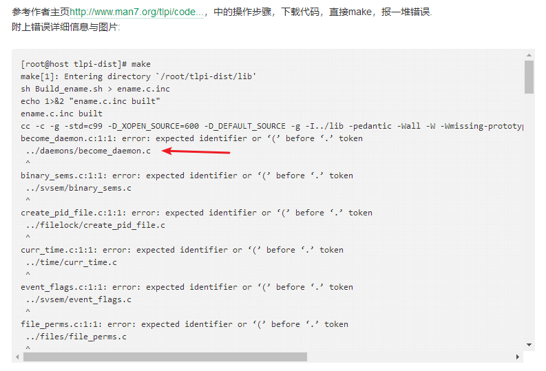
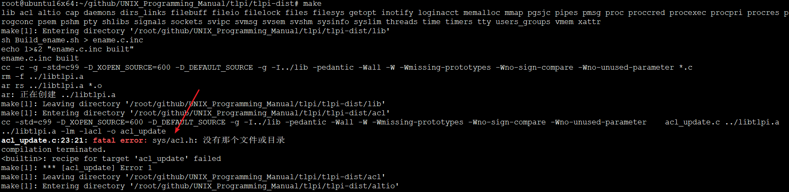
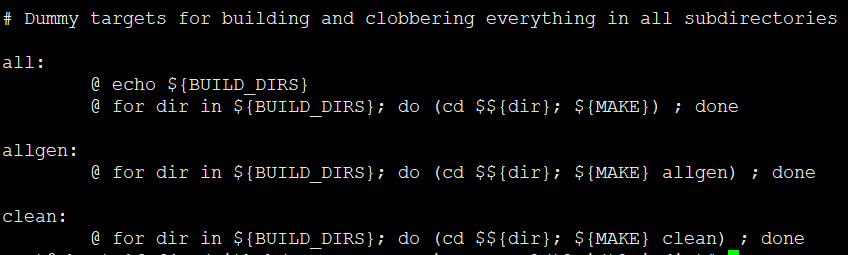

<!-- TOC depthFrom:1 depthTo:6 withLinks:1 updateOnSave:1 orderedList:0 -->

- [TLPI环境搭建](#tlpi环境搭建)
	- [源码获取](#源码获取)
	- [常见编译错误解决](#常见编译错误解决)
	- [官方README](#官方readme)
	- [官方BUILDING帮助](#官方building帮助)
	- [正常编译过程](#正常编译过程)
	- [后续操作](#后续操作)
	- [Makefile](#makefile)
	- [END](#end)

<!-- /TOC -->
# TLPI环境搭建

## 源码获取


源代码主页链接：<http://man7.org/tlpi/code/index.html>

源代码有两个版本，Distribution version Book version


## 常见编译错误解决



这个。。这个问题刚碰到，其实，这个问题很简单命令，就是Linux软链接文件在windows解压了，软链接里面就是个连接地址，而实际指向一个.c文件，所以。gcc不能智能找到。你肯定有某种操作把软链接干掉成了普通文件。maybe你在windows解压，samba后linux编译。。这是典型。或者Windows解压拷贝到linux。。解决办法呢就更简单了，压缩包在linux解压



```
root@ubuntu16x64:~# apt-get install uuid-dev libacl1-dev liblzo2-dev
正在读取软件包列表... 完成
正在分析软件包的依赖关系树       
正在读取状态信息... 完成       
liblzo2-dev 已经是最新版 (2.08-1.2)。
uuid-dev 已经是最新版 (2.27.1-6ubuntu3.4)。
uuid-dev 已设置为手动安装。
将会同时安装下列软件：
  libattr1-dev
下列【新】软件包将被安装：
  libacl1-dev libattr1-dev
升级了 0 个软件包，新安装了 2 个软件包，要卸载 0 个软件包，有 52 个软件包未被升级。
需要下载 104 kB 的归档。
解压缩后会消耗 345 kB 的额外空间。
您希望继续执行吗？ [Y/n] y
获取:1 http://mirrors.aliyun.com/ubuntu xenial/main amd64 libattr1-dev amd64 1:2.4.47-2 [30.2 kB]
获取:2 http://mirrors.aliyun.com/ubuntu xenial/main amd64 libacl1-dev amd64 2.2.52-3 [73.6 kB]
已下载 104 kB，耗时 0秒 (121 kB/s)    
正在选中未选择的软件包 libattr1-dev:amd64。
(正在读取数据库 ... 系统当前共安装有 263329 个文件和目录。)
正准备解包 .../libattr1-dev_1%3a2.4.47-2_amd64.deb  ...
正在解包 libattr1-dev:amd64 (1:2.4.47-2) ...
正在选中未选择的软件包 libacl1-dev。
正准备解包 .../libacl1-dev_2.2.52-3_amd64.deb  ...
正在解包 libacl1-dev (2.2.52-3) ...
正在处理用于 man-db (2.7.5-1) 的触发器 ...
正在设置 libattr1-dev:amd64 (1:2.4.47-2) ...
正在设置 libacl1-dev (2.2.52-3) ...
root@ubuntu16x64:~#
```

## 官方README

```
README for code in The Linux Programming Interface

Gidday!

This is the code for the book "The Linux Programming Interface"
and this is a note from me, the author, Michael Kerrisk.

For instructions on building the programs, see the file BUILDING.

For notes on changes that have been made to the code since it was
published in the book, see the file CHANGES.


Source code licensing
=====================

All complete programs provided in this distribution are covered by
the GNU General Public License (Version 3), a copy of which is
contained in the file COPYING.gpl-v3, which should have arrived with
this tarball.  The library functions (in the lib/ directory) are
covered by the GNU Lesser General Public License (Version 3); see the
files COPYING.lgpl-v3 and COPYING.gpl-v3 provided with this tarball.


A note on the source code
=========================

The source code is available in two versions: "dist" and "book".
The "book" version contains the program source files as published in
the book. The source files in the "dist" version contain extra code
beyond that published in the book. The differences between the "dist"
and "book" versions are as follows:

a) The "dist" versions of some programs contain extra comments.
   These additional comments were stripped out of the printed version
   to make the published versions of the programs shorter. (The book
   itself contains text describing the operation of the programs.)

b) In a few cases, some changes have been incorporated into the
   "dist" versions to make it possible to compile programs on UNIX
   implementations other than Linux, so that you can try them out
   on other implementations if you wish.  Where necessary, the
   additional code is conditionally compiled using the following
   platform-specific macros:

        __linux__       Defined on Linux
        __sun           Defined on Solaris
        __FreeBSD__     Defined on FreeBSD
        __NetBSD__      Defined on NetBSD
        __OpenBSD__     Defined on OpenBSD
        __APPLE__       Defined on Mac OS X
        __hpux          Defined on HP-UX
        __osf__         Defined on Tru64 UNIX (formerly DEC OSF1)
        __sgi           Defined on Irix
        _AIX            Defined on AIX

c) In the "dist" version, some programs have extra functionality beyond
   that in the "book" versions. Where this is significant, comments in
   the programs explain the differences.


Subdirectories
==============

Under the 'tlpi' directory are a number of subdirectories. Each
subdirectory corresponds to one or more chapters of the book.
The following paragraphs give brief notes on the contents of
each subdirectory.

Note that in some cases, files are (hard) linked to appear in more than
one directory. This is particularly the case for each of the files in
the 'lib' directory, most of which are also linked in the directory
of the chapter relating to that file.

Directory       Files for Chapter...

lib             This contains library routines used by other
                programs. The tlpi_hdr.h and error_functions.*
                files are located here.

progconc        3 (System Programming Concepts)

fileio          4 and 5 (File I/O)

proc            6 (Processes)

memalloc        7 (Memory Allocation)

users_groups    8 (Users and Groups)

proccred        9 (Process Credentials)

time            10 (Time)

syslim          11 (System Limits and Options)

sysinfo         12 (System and Process Information)

filebuff        13 (File I/O Buffering)

filesys         14 (File Systems)

files           15 (File Attributes)

xattr           16 (Extended Attributes)

acl             17 (Access Control Lists)

dirs_links      18 (Directories and Links)

inotify         19 (Monitoring File Events)

signals         20 to 22 (Signals)

timers          23 (Timers and Sleeping)

procexec        24 (Process Creation), 25 (Process Termination),
                26 (Monitoring Child Processes), 27 (Program Execution),
                and 28 (Further Details on Process Creation and Program
                Execution)

threads         29 to 33 (POSIX Threads)

pgsjc           34 (Process Groups, Sessions, and Job Control)

procpri         35 (Process Priorities and Scheduling)

procres         36 (Process Resources)

daemons         37 (Daemons)

cap             39 (Capabilities)

loginacct       40 (Login Accounting)

shlibs          41 and 42 (Shared Libraries)

pipes           44 (Pipes and FIFOs)

svipc           45 (System V IPC)

svmsg           46 (System V Message Queues)

svsem           47 (System V Semaphores)

svshm           48 (System V Shared Memory)

mmap            49 (Memory Mappings)

vmem            50 (Virtual Memory Operations)

pmsg            52 (POSIX Message Queues)

psem            53 (POSIX Semaphores)

pshm            54 (POSIX Shared Memory)

filelock        55 (File Locking)

sockets         56 to 61 (Sockets and Network Programming)

tty             62 (Terminals)

altio           63 (Alternative I/O Models)

pty             64 (Pseudoterminals)

getopt          Appendix B: Parsing Command-Line Options
```

## 官方BUILDING帮助

```
BUILDING notes for code in The Linux Programming Interface

PLEASE TAKE NOTE!
=================

If you have difficulty building the programs, then the problem is most
likely one of the following:

a) A configuration issue on your system (e.g., do you have the 'libacl'
   library installed?).
b) You are using a system with an older Linux kernel or an older
   version of glibc. If this is so, your system may not provide a
   more recent system call or library function, or the glibc headers
   may not provide a needed function declaration or constant
   definition.

I can't really help with fixing these problems. However, do take
a look at the online code FAQ (http://man7.org/tlpi/code/faq.html)
for some frequently asked questions about the code. You may find
the answer to your problem there.

If, after ensuring that the problem is not a configuration issue on your
system (did you try compiling the program(s) on a different system?) and
checking the FAQ, you still have a problem *and* you have a solution, then
please do let me know, and I will publish the fix on the web site.


Unpacking the code tarball
==========================

Unpacking the tarball with the command

        tar xfz tlpi-YYMMDD-xxxx.tar.gz

will create a directory tree 'tlpi-xxxx' containing all of the source code
("xxxx" will be either "dist" or "book" depending on which version of the
source code tarball you downloaded).


Building the programs on Linux
==============================

(For instructions on building the programs on other UNIX
implementations, see the notes lower down in this file.)

The methods described below involve the use of 'make'. If you need
more information on 'make', try the command 'man make' or 'info make'.


Method A - Building all programs in all directories
---------------------------------------------------

Go into the 'tlpi' subdirectory, and type 'make':

        cd tlpi-xxxx
        make

This will build all programs in all subdirectories.


Method B - Build programs in individual directories
---------------------------------------------------

1) First, build the library used by all programs:

        cd lib
        make            # This will make libtlpi.a and place
                        # it in the parent directory

2) Build programs using the 'Makefile' in each subdirectory.

In each subdirectory, there is a file called 'Makefile' that can be
used with the 'make' command to build the programs in that directory.
To build a particular program you can simply say:

        make progname

where 'progname' is one of the C (main) programs in the directory.
Thus, to build the executable for the program 'copy.c' you would use
the command:

        make copy

Each makefile also contains the following special targets (which are
named according to the usual 'make' conventions):

all     This target will build all programs in the subdirectory.
        Simply enter the command:

                make all

clean   This target cleans up, by removing all executables and object
        files created by the makefile:

                make clean


Building the programs on other UNIX implementations
===================================================

I have gone to some effort to ensure that, where possible, the programs
work on other UNIX implementations also.

Obviously, some of the example programs employ Linux-specific features,
and won't compile on other UNIX implementations. As a first indication
of what works on Linux, and what may work elsewhere, look in the
makefiles in each directory. Most of the makefiles define two macros:

LINUX_EXE       These are programs that probably won't work
                on anything other than Linux.

GEN_EXE         These programs may compile on other UNIX implementations.
                I say "may", because of course not all implementations
                provide exactly the same features. The presence of a
                program in this list indicates that it compiles and runs
                on at least some UNIX implementations other than Linux.


Instructions
------------

1. Edit Makefile.inc in the 'tlpi' root directory to modify the
   definitions of the CFLAGS and LDLIBS macros (and possibly other
   macros depending on your version of make(1)) as appropriate.
   Probably you'll need to define CFLAGS as follows:

        CFLAGS += -g -I${TLPI_INCL_DIR}

   The setting of LDLIBS is a bit harder to determine. As well as
   listing the libary for this book, you should include '-l' linker
   options for any other libraries that the programs may need.
   For example, the following is suitable on Solaris 8:

        LDLIBS = ${TLPI_LIB} -lsocket -lnsl -lrt -ldl -lm -lresolv

   **** NOTE:   Under the 'tlpi' root directory you'll find a few sample
                replacement files for 'Makefile.inc', named
                'Makefile.inc.*'. You may be able to simply copy the
                appropriate file to 'Makefile.inc'.

2. Try the following to build all of the GEN_EXE programs:

        cd tlpi-xxxx
        make -k allgen

   The '-k' option tells 'make' to build as much as possible, so that if
   a particular program won't compile, 'make' goes on to attempt to
   build the remaining programs.
```

## 正常编译过程

```
root@ubuntu16x64:~/github/UNIX_Programming_Manual/tlpi/tlpi-dist# make all
lib acl altio cap daemons dirs_links filebuff fileio filelock files filesys getopt inotify loginacct memalloc mmap pgsjc pipes pmsg proc proccred procexec procpri procres progconc psem pshm pty shlibs signals sockets svipc svmsg svsem svshm sysinfo syslim threads time timers tty users_groups vmem xattr
make[1]: Entering directory '/root/github/UNIX_Programming_Manual/tlpi/tlpi-dist/lib'
sh Build_ename.sh > ename.c.inc
echo 1>&2 "ename.c.inc built"
ename.c.inc built
cc -c -g -std=c99 -D_XOPEN_SOURCE=600 -D_DEFAULT_SOURCE -g -I../lib -pedantic -Wall -W -Wmissing-prototypes -Wno-sign-compare -Wno-unused-parameter *.c
rm -f ../libtlpi.a
ar rs ../libtlpi.a *.o
ar: 正在创建 ../libtlpi.a
make[1]: Leaving directory '/root/github/UNIX_Programming_Manual/tlpi/tlpi-dist/lib'
make[1]: Entering directory '/root/github/UNIX_Programming_Manual/tlpi/tlpi-dist/acl'
cc -std=c99 -D_XOPEN_SOURCE=600 -D_DEFAULT_SOURCE -g -I../lib -pedantic -Wall -W -Wmissing-prototypes -Wno-sign-compare -Wno-unused-parameter    acl_update.c ../libtlpi.a  ../libtlpi.a -lm -lacl -o acl_update
cc -std=c99 -D_XOPEN_SOURCE=600 -D_DEFAULT_SOURCE -g -I../lib -pedantic -Wall -W -Wmissing-prototypes -Wno-sign-compare -Wno-unused-parameter    acl_view.c ../libtlpi.a  ../libtlpi.a -lm -lacl -o acl_view
make[1]: Leaving directory '/root/github/UNIX_Programming_Manual/tlpi/tlpi-dist/acl'
make[1]: Entering directory '/root/github/UNIX_Programming_Manual/tlpi/tlpi-dist/altio'
cc -std=c99 -D_XOPEN_SOURCE=600 -D_DEFAULT_SOURCE -g -I../lib -pedantic -Wall -W -Wmissing-prototypes -Wno-sign-compare -Wno-unused-parameter    demo_sigio.c ../libtlpi.a  ../libtlpi.a -lm -o demo_sigio
cc -std=c99 -D_XOPEN_SOURCE=600 -D_DEFAULT_SOURCE -g -I../lib -pedantic -Wall -W -Wmissing-prototypes -Wno-sign-compare -Wno-unused-parameter    poll_pipes.c ../libtlpi.a  ../libtlpi.a -lm -o poll_pipes
cc -std=c99 -D_XOPEN_SOURCE=600 -D_DEFAULT_SOURCE -g -I../lib -pedantic -Wall -W -Wmissing-prototypes -Wno-sign-compare -Wno-unused-parameter    select_mq.c ../libtlpi.a  ../libtlpi.a -lm -o select_mq
cc -std=c99 -D_XOPEN_SOURCE=600 -D_DEFAULT_SOURCE -g -I../lib -pedantic -Wall -W -Wmissing-prototypes -Wno-sign-compare -Wno-unused-parameter    self_pipe.c ../libtlpi.a  ../libtlpi.a -lm -o self_pipe
cc -std=c99 -D_XOPEN_SOURCE=600 -D_DEFAULT_SOURCE -g -I../lib -pedantic -Wall -W -Wmissing-prototypes -Wno-sign-compare -Wno-unused-parameter    t_select.c ../libtlpi.a  ../libtlpi.a -lm -o t_select
cc -std=c99 -D_XOPEN_SOURCE=600 -D_DEFAULT_SOURCE -g -I../lib -pedantic -Wall -W -Wmissing-prototypes -Wno-sign-compare -Wno-unused-parameter    epoll_input.c ../libtlpi.a  ../libtlpi.a -lm -o epoll_input
make[1]: Leaving directory '/root/github/UNIX_Programming_Manual/tlpi/tlpi-dist/altio'
make[1]: Entering directory '/root/github/UNIX_Programming_Manual/tlpi/tlpi-dist/cap'
cc -std=c99 -D_XOPEN_SOURCE=600 -D_DEFAULT_SOURCE -g -I../lib -pedantic -Wall -W -Wmissing-prototypes -Wno-sign-compare -Wno-unused-parameter    cap_text.c ../libtlpi.a  ../libtlpi.a -lm -lcap -lcrypt -o cap_text
cc -std=c99 -D_XOPEN_SOURCE=600 -D_DEFAULT_SOURCE -g -I../lib -pedantic -Wall -W -Wmissing-prototypes -Wno-sign-compare -Wno-unused-parameter    check_password_caps.c ../libtlpi.a  ../libtlpi.a -lm -lcap -lcrypt -o check_password_caps
make[1]: Leaving directory '/root/github/UNIX_Programming_Manual/tlpi/tlpi-dist/cap'
make[1]: Entering directory '/root/github/UNIX_Programming_Manual/tlpi/tlpi-dist/daemons'
cc -std=c99 -D_XOPEN_SOURCE=600 -D_DEFAULT_SOURCE -g -I../lib -pedantic -Wall -W -Wmissing-prototypes -Wno-sign-compare -Wno-unused-parameter    daemon_SIGHUP.c ../libtlpi.a  ../libtlpi.a -lm -o daemon_SIGHUP
cc -std=c99 -D_XOPEN_SOURCE=600 -D_DEFAULT_SOURCE -g -I../lib -pedantic -Wall -W -Wmissing-prototypes -Wno-sign-compare -Wno-unused-parameter    t_syslog.c ../libtlpi.a  ../libtlpi.a -lm -o t_syslog
cc -std=c99 -D_XOPEN_SOURCE=600 -D_DEFAULT_SOURCE -g -I../lib -pedantic -Wall -W -Wmissing-prototypes -Wno-sign-compare -Wno-unused-parameter    test_become_daemon.c ../libtlpi.a  ../libtlpi.a -lm -o test_become_daemon
make[1]: Leaving directory '/root/github/UNIX_Programming_Manual/tlpi/tlpi-dist/daemons'
make[1]: Entering directory '/root/github/UNIX_Programming_Manual/tlpi/tlpi-dist/dirs_links'
cc -std=c99 -D_XOPEN_SOURCE=600 -D_DEFAULT_SOURCE -g -I../lib -pedantic -Wall -W -Wmissing-prototypes -Wno-sign-compare -Wno-unused-parameter    bad_symlink.c ../libtlpi.a  ../libtlpi.a -lm -o bad_symlink
cc -std=c99 -D_XOPEN_SOURCE=600 -D_DEFAULT_SOURCE -g -I../lib -pedantic -Wall -W -Wmissing-prototypes -Wno-sign-compare -Wno-unused-parameter    file_type_stats.c ../libtlpi.a  ../libtlpi.a -lm -o file_type_stats
cc -std=c99 -D_XOPEN_SOURCE=600 -D_DEFAULT_SOURCE -g -I../lib -pedantic -Wall -W -Wmissing-prototypes -Wno-sign-compare -Wno-unused-parameter    list_files.c ../libtlpi.a  ../libtlpi.a -lm -o list_files
cc -std=c99 -D_XOPEN_SOURCE=600 -D_DEFAULT_SOURCE -g -I../lib -pedantic -Wall -W -Wmissing-prototypes -Wno-sign-compare -Wno-unused-parameter    list_files_readdir_r.c ../libtlpi.a  ../libtlpi.a -lm -o list_files_readdir_r
cc -std=c99 -D_XOPEN_SOURCE=600 -D_DEFAULT_SOURCE -g -I../lib -pedantic -Wall -W -Wmissing-prototypes -Wno-sign-compare -Wno-unused-parameter    nftw_dir_tree.c ../libtlpi.a  ../libtlpi.a -lm -o nftw_dir_tree
cc -std=c99 -D_XOPEN_SOURCE=600 -D_DEFAULT_SOURCE -g -I../lib -pedantic -Wall -W -Wmissing-prototypes -Wno-sign-compare -Wno-unused-parameter    t_dirbasename.c ../libtlpi.a  ../libtlpi.a -lm -o t_dirbasename
cc -std=c99 -D_XOPEN_SOURCE=600 -D_DEFAULT_SOURCE -g -I../lib -pedantic -Wall -W -Wmissing-prototypes -Wno-sign-compare -Wno-unused-parameter    t_unlink.c ../libtlpi.a  ../libtlpi.a -lm -o t_unlink
cc -std=c99 -D_XOPEN_SOURCE=600 -D_DEFAULT_SOURCE -g -I../lib -pedantic -Wall -W -Wmissing-prototypes -Wno-sign-compare -Wno-unused-parameter    view_symlink.c ../libtlpi.a  ../libtlpi.a -lm -o view_symlink
make[1]: Leaving directory '/root/github/UNIX_Programming_Manual/tlpi/tlpi-dist/dirs_links'
make[1]: Entering directory '/root/github/UNIX_Programming_Manual/tlpi/tlpi-dist/filebuff'
cc -std=c99 -D_XOPEN_SOURCE=600 -D_DEFAULT_SOURCE -g -I../lib -pedantic -Wall -W -Wmissing-prototypes -Wno-sign-compare -Wno-unused-parameter    copy.c ../libtlpi.a  ../libtlpi.a -lm -o copy
cc -std=c99 -D_XOPEN_SOURCE=600 -D_DEFAULT_SOURCE -g -I../lib -pedantic -Wall -W -Wmissing-prototypes -Wno-sign-compare -Wno-unused-parameter    mix23_linebuff.c ../libtlpi.a  ../libtlpi.a -lm -o mix23_linebuff
cc -std=c99 -D_XOPEN_SOURCE=600 -D_DEFAULT_SOURCE -g -I../lib -pedantic -Wall -W -Wmissing-prototypes -Wno-sign-compare -Wno-unused-parameter    mix23io.c ../libtlpi.a  ../libtlpi.a -lm -o mix23io
cc -std=c99 -D_XOPEN_SOURCE=600 -D_DEFAULT_SOURCE -g -I../lib -pedantic -Wall -W -Wmissing-prototypes -Wno-sign-compare -Wno-unused-parameter    write_bytes.c ../libtlpi.a  ../libtlpi.a -lm -o write_bytes
cc -DUSE_FDATASYNC -o write_bytes_fdatasync write_bytes.c -std=c99 -D_XOPEN_SOURCE=600 -D_DEFAULT_SOURCE -g -I../lib -pedantic -Wall -W -Wmissing-prototypes -Wno-sign-compare -Wno-unused-parameter ../libtlpi.a -lm
cc -DUSE_FSYNC -o write_bytes_fsync write_bytes.c -std=c99 -D_XOPEN_SOURCE=600 -D_DEFAULT_SOURCE -g -I../lib -pedantic -Wall -W -Wmissing-prototypes -Wno-sign-compare -Wno-unused-parameter ../libtlpi.a -lm
cc -DUSE_O_SYNC -o write_bytes_o_sync write_bytes.c -std=c99 -D_XOPEN_SOURCE=600 -D_DEFAULT_SOURCE -g -I../lib -pedantic -Wall -W -Wmissing-prototypes -Wno-sign-compare -Wno-unused-parameter ../libtlpi.a -lm
cc -std=c99 -D_XOPEN_SOURCE=600 -D_DEFAULT_SOURCE -g -I../lib -pedantic -Wall -W -Wmissing-prototypes -Wno-sign-compare -Wno-unused-parameter    direct_read.c ../libtlpi.a  ../libtlpi.a -lm -o direct_read
make[1]: Leaving directory '/root/github/UNIX_Programming_Manual/tlpi/tlpi-dist/filebuff'
make[1]: Entering directory '/root/github/UNIX_Programming_Manual/tlpi/tlpi-dist/fileio'
cc -std=c99 -D_XOPEN_SOURCE=600 -D_DEFAULT_SOURCE -g -I../lib -pedantic -Wall -W -Wmissing-prototypes -Wno-sign-compare -Wno-unused-parameter    atomic_append.c ../libtlpi.a  ../libtlpi.a -lm -o atomic_append
cc -std=c99 -D_XOPEN_SOURCE=600 -D_DEFAULT_SOURCE -g -I../lib -pedantic -Wall -W -Wmissing-prototypes -Wno-sign-compare -Wno-unused-parameter    bad_exclusive_open.c ../libtlpi.a  ../libtlpi.a -lm -o bad_exclusive_open
cc -std=c99 -D_XOPEN_SOURCE=600 -D_DEFAULT_SOURCE -g -I../lib -pedantic -Wall -W -Wmissing-prototypes -Wno-sign-compare -Wno-unused-parameter    copy.c ../libtlpi.a  ../libtlpi.a -lm -o copy
cc -std=c99 -D_XOPEN_SOURCE=600 -D_DEFAULT_SOURCE -g -I../lib -pedantic -Wall -W -Wmissing-prototypes -Wno-sign-compare -Wno-unused-parameter    multi_descriptors.c ../libtlpi.a  ../libtlpi.a -lm -o multi_descriptors
cc -std=c99 -D_XOPEN_SOURCE=600 -D_DEFAULT_SOURCE -g -I../lib -pedantic -Wall -W -Wmissing-prototypes -Wno-sign-compare -Wno-unused-parameter    seek_io.c ../libtlpi.a  ../libtlpi.a -lm -o seek_io
cc -std=c99 -D_XOPEN_SOURCE=600 -D_DEFAULT_SOURCE -g -I../lib -pedantic -Wall -W -Wmissing-prototypes -Wno-sign-compare -Wno-unused-parameter    t_readv.c ../libtlpi.a  ../libtlpi.a -lm -o t_readv
cc -std=c99 -D_XOPEN_SOURCE=600 -D_DEFAULT_SOURCE -g -I../lib -pedantic -Wall -W -Wmissing-prototypes -Wno-sign-compare -Wno-unused-parameter    t_truncate.c ../libtlpi.a  ../libtlpi.a -lm -o t_truncate
cc -std=c99 -D_XOPEN_SOURCE=600 -D_DEFAULT_SOURCE -g -I../lib -pedantic -Wall -W -Wmissing-prototypes -Wno-sign-compare -Wno-unused-parameter    large_file.c ../libtlpi.a  ../libtlpi.a -lm -o large_file
make[1]: Leaving directory '/root/github/UNIX_Programming_Manual/tlpi/tlpi-dist/fileio'
make[1]: Entering directory '/root/github/UNIX_Programming_Manual/tlpi/tlpi-dist/filelock'
cc -std=c99 -D_XOPEN_SOURCE=600 -D_DEFAULT_SOURCE -g -I../lib -pedantic -Wall -W -Wmissing-prototypes -Wno-sign-compare -Wno-unused-parameter    i_fcntl_locking.c ../libtlpi.a  ../libtlpi.a -lm -o i_fcntl_locking
cc -std=c99 -D_XOPEN_SOURCE=600 -D_DEFAULT_SOURCE -g -I../lib -pedantic -Wall -W -Wmissing-prototypes -Wno-sign-compare -Wno-unused-parameter    t_flock.c ../libtlpi.a  ../libtlpi.a -lm -o t_flock
make[1]: Leaving directory '/root/github/UNIX_Programming_Manual/tlpi/tlpi-dist/filelock'
make[1]: Entering directory '/root/github/UNIX_Programming_Manual/tlpi/tlpi-dist/files'
cc -std=c99 -D_XOPEN_SOURCE=600 -D_DEFAULT_SOURCE -g -I../lib -pedantic -Wall -W -Wmissing-prototypes -Wno-sign-compare -Wno-unused-parameter    t_chown.c ../libtlpi.a  ../libtlpi.a -lm -o t_chown
cc -std=c99 -D_XOPEN_SOURCE=600 -D_DEFAULT_SOURCE -g -I../lib -pedantic -Wall -W -Wmissing-prototypes -Wno-sign-compare -Wno-unused-parameter    t_stat.c ../libtlpi.a  ../libtlpi.a -lm -o t_stat
cc -std=c99 -D_XOPEN_SOURCE=600 -D_DEFAULT_SOURCE -g -I../lib -pedantic -Wall -W -Wmissing-prototypes -Wno-sign-compare -Wno-unused-parameter    t_umask.c ../libtlpi.a  ../libtlpi.a -lm -o t_umask
cc -std=c99 -D_XOPEN_SOURCE=600 -D_DEFAULT_SOURCE -g -I../lib -pedantic -Wall -W -Wmissing-prototypes -Wno-sign-compare -Wno-unused-parameter    t_utime.c ../libtlpi.a  ../libtlpi.a -lm -o t_utime
cc -std=c99 -D_XOPEN_SOURCE=600 -D_DEFAULT_SOURCE -g -I../lib -pedantic -Wall -W -Wmissing-prototypes -Wno-sign-compare -Wno-unused-parameter    t_utimes.c ../libtlpi.a  ../libtlpi.a -lm -o t_utimes
cc -std=c99 -D_XOPEN_SOURCE=600 -D_DEFAULT_SOURCE -g -I../lib -pedantic -Wall -W -Wmissing-prototypes -Wno-sign-compare -Wno-unused-parameter    chiflag.c ../libtlpi.a  ../libtlpi.a -lm -o chiflag
make[1]: Leaving directory '/root/github/UNIX_Programming_Manual/tlpi/tlpi-dist/files'
make[1]: Entering directory '/root/github/UNIX_Programming_Manual/tlpi/tlpi-dist/filesys'
cc -std=c99 -D_XOPEN_SOURCE=600 -D_DEFAULT_SOURCE -g -I../lib -pedantic -Wall -W -Wmissing-prototypes -Wno-sign-compare -Wno-unused-parameter    t_statvfs.c ../libtlpi.a  ../libtlpi.a -lm -o t_statvfs
cc -std=c99 -D_XOPEN_SOURCE=600 -D_DEFAULT_SOURCE -g -I../lib -pedantic -Wall -W -Wmissing-prototypes -Wno-sign-compare -Wno-unused-parameter    t_statfs.c ../libtlpi.a  ../libtlpi.a -lm -o t_statfs
cc -std=c99 -D_XOPEN_SOURCE=600 -D_DEFAULT_SOURCE -g -I../lib -pedantic -Wall -W -Wmissing-prototypes -Wno-sign-compare -Wno-unused-parameter    t_mount.c ../libtlpi.a  ../libtlpi.a -lm -o t_mount
cc -std=c99 -D_XOPEN_SOURCE=600 -D_DEFAULT_SOURCE -g -I../lib -pedantic -Wall -W -Wmissing-prototypes -Wno-sign-compare -Wno-unused-parameter    t_umount.c ../libtlpi.a  ../libtlpi.a -lm -o t_umount
make[1]: Leaving directory '/root/github/UNIX_Programming_Manual/tlpi/tlpi-dist/filesys'
make[1]: Entering directory '/root/github/UNIX_Programming_Manual/tlpi/tlpi-dist/getopt'
cc -std=c99 -D_XOPEN_SOURCE=600 -D_DEFAULT_SOURCE -g -I../lib -pedantic -Wall -W -Wmissing-prototypes -Wno-sign-compare -Wno-unused-parameter    t_getopt.c ../libtlpi.a  ../libtlpi.a -lm -o t_getopt
make[1]: Leaving directory '/root/github/UNIX_Programming_Manual/tlpi/tlpi-dist/getopt'
make[1]: Entering directory '/root/github/UNIX_Programming_Manual/tlpi/tlpi-dist/inotify'
cc -std=c99 -D_XOPEN_SOURCE=600 -D_DEFAULT_SOURCE -g -I../lib -pedantic -Wall -W -Wmissing-prototypes -Wno-sign-compare -Wno-unused-parameter    demo_inotify.c ../libtlpi.a  ../libtlpi.a -lm -o demo_inotify
cc -std=c99 -D_XOPEN_SOURCE=600 -D_DEFAULT_SOURCE -g -I../lib -pedantic -Wall -W -Wmissing-prototypes -Wno-sign-compare -Wno-unused-parameter    dnotify.c ../libtlpi.a  ../libtlpi.a -lm -o dnotify
cc -std=c99 -D_XOPEN_SOURCE=600 -D_DEFAULT_SOURCE -g -I../lib -pedantic -Wall -W -Wmissing-prototypes -Wno-sign-compare -Wno-unused-parameter    inotify_dtree.c ../libtlpi.a  ../libtlpi.a -lm -o inotify_dtree
cc -std=c99 -D_XOPEN_SOURCE=600 -D_DEFAULT_SOURCE -g -I../lib -pedantic -Wall -W -Wmissing-prototypes -Wno-sign-compare -Wno-unused-parameter    rand_dtree.c ../libtlpi.a  ../libtlpi.a -lm -o rand_dtree
make[1]: Leaving directory '/root/github/UNIX_Programming_Manual/tlpi/tlpi-dist/inotify'
make[1]: Entering directory '/root/github/UNIX_Programming_Manual/tlpi/tlpi-dist/loginacct'
cc -std=c99 -D_XOPEN_SOURCE=600 -D_DEFAULT_SOURCE -g -I../lib -pedantic -Wall -W -Wmissing-prototypes -Wno-sign-compare -Wno-unused-parameter    dump_utmpx.c ../libtlpi.a  ../libtlpi.a -lm -o dump_utmpx
cc -std=c99 -D_XOPEN_SOURCE=600 -D_DEFAULT_SOURCE -g -I../lib -pedantic -Wall -W -Wmissing-prototypes -Wno-sign-compare -Wno-unused-parameter    utmpx_login.c ../libtlpi.a  ../libtlpi.a -lm -o utmpx_login
cc -std=c99 -D_XOPEN_SOURCE=600 -D_DEFAULT_SOURCE -g -I../lib -pedantic -Wall -W -Wmissing-prototypes -Wno-sign-compare -Wno-unused-parameter    view_lastlog.c ../libtlpi.a  ../libtlpi.a -lm -o view_lastlog
make[1]: Leaving directory '/root/github/UNIX_Programming_Manual/tlpi/tlpi-dist/loginacct'
make[1]: Entering directory '/root/github/UNIX_Programming_Manual/tlpi/tlpi-dist/memalloc'
cc -std=c99 -D_XOPEN_SOURCE=600 -D_DEFAULT_SOURCE -g -I../lib -pedantic -Wall -W -Wmissing-prototypes -Wno-sign-compare -Wno-unused-parameter    free_and_sbrk.c ../libtlpi.a  ../libtlpi.a -lm -o free_and_sbrk
make[1]: Leaving directory '/root/github/UNIX_Programming_Manual/tlpi/tlpi-dist/memalloc'
make[1]: Entering directory '/root/github/UNIX_Programming_Manual/tlpi/tlpi-dist/mmap'
cc -std=c99 -D_XOPEN_SOURCE=600 -D_DEFAULT_SOURCE -g -I../lib -pedantic -Wall -W -Wmissing-prototypes -Wno-sign-compare -Wno-unused-parameter    anon_mmap.c ../libtlpi.a  ../libtlpi.a -lm -o anon_mmap
cc -std=c99 -D_XOPEN_SOURCE=600 -D_DEFAULT_SOURCE -g -I../lib -pedantic -Wall -W -Wmissing-prototypes -Wno-sign-compare -Wno-unused-parameter    mmcat.c ../libtlpi.a  ../libtlpi.a -lm -o mmcat
cc -std=c99 -D_XOPEN_SOURCE=600 -D_DEFAULT_SOURCE -g -I../lib -pedantic -Wall -W -Wmissing-prototypes -Wno-sign-compare -Wno-unused-parameter    mmcopy.c ../libtlpi.a  ../libtlpi.a -lm -o mmcopy
cc -std=c99 -D_XOPEN_SOURCE=600 -D_DEFAULT_SOURCE -g -I../lib -pedantic -Wall -W -Wmissing-prototypes -Wno-sign-compare -Wno-unused-parameter    t_mmap.c ../libtlpi.a  ../libtlpi.a -lm -o t_mmap
cc -std=c99 -D_XOPEN_SOURCE=600 -D_DEFAULT_SOURCE -g -I../lib -pedantic -Wall -W -Wmissing-prototypes -Wno-sign-compare -Wno-unused-parameter    t_remap_file_pages.c ../libtlpi.a  ../libtlpi.a -lm -o t_remap_file_pages
make[1]: Leaving directory '/root/github/UNIX_Programming_Manual/tlpi/tlpi-dist/mmap'
make[1]: Entering directory '/root/github/UNIX_Programming_Manual/tlpi/tlpi-dist/pgsjc'
cc -std=c99 -D_XOPEN_SOURCE=600 -D_DEFAULT_SOURCE -g -I../lib -pedantic -Wall -W -Wmissing-prototypes -Wno-sign-compare -Wno-unused-parameter    catch_SIGHUP.c ../libtlpi.a  ../libtlpi.a -lm -o catch_SIGHUP
cc -std=c99 -D_XOPEN_SOURCE=600 -D_DEFAULT_SOURCE -g -I../lib -pedantic -Wall -W -Wmissing-prototypes -Wno-sign-compare -Wno-unused-parameter    disc_SIGHUP.c ../libtlpi.a  ../libtlpi.a -lm -o disc_SIGHUP
cc -std=c99 -D_XOPEN_SOURCE=600 -D_DEFAULT_SOURCE -g -I../lib -pedantic -Wall -W -Wmissing-prototypes -Wno-sign-compare -Wno-unused-parameter    job_mon.c ../libtlpi.a  ../libtlpi.a -lm -o job_mon
cc -std=c99 -D_XOPEN_SOURCE=600 -D_DEFAULT_SOURCE -g -I../lib -pedantic -Wall -W -Wmissing-prototypes -Wno-sign-compare -Wno-unused-parameter    orphaned_pgrp_SIGHUP.c ../libtlpi.a  ../libtlpi.a -lm -o orphaned_pgrp_SIGHUP
cc -std=c99 -D_XOPEN_SOURCE=600 -D_DEFAULT_SOURCE -g -I../lib -pedantic -Wall -W -Wmissing-prototypes -Wno-sign-compare -Wno-unused-parameter    handling_SIGTSTP.c ../libtlpi.a  ../libtlpi.a -lm -o handling_SIGTSTP
cc -std=c99 -D_XOPEN_SOURCE=600 -D_DEFAULT_SOURCE -g -I../lib -pedantic -Wall -W -Wmissing-prototypes -Wno-sign-compare -Wno-unused-parameter    t_setsid.c ../libtlpi.a  ../libtlpi.a -lm -o t_setsid
make[1]: Leaving directory '/root/github/UNIX_Programming_Manual/tlpi/tlpi-dist/pgsjc'
make[1]: Entering directory '/root/github/UNIX_Programming_Manual/tlpi/tlpi-dist/pipes'
cc -std=c99 -D_XOPEN_SOURCE=600 -D_DEFAULT_SOURCE -g -I../lib -pedantic -Wall -W -Wmissing-prototypes -Wno-sign-compare -Wno-unused-parameter    change_case.c ../libtlpi.a  ../libtlpi.a -lm -o change_case
cc -std=c99 -D_XOPEN_SOURCE=600 -D_DEFAULT_SOURCE -g -I../lib -pedantic -Wall -W -Wmissing-prototypes -Wno-sign-compare -Wno-unused-parameter   -c -o fifo_seqnum_client.o fifo_seqnum_client.c
cc   fifo_seqnum_client.o ../libtlpi.a  ../libtlpi.a -lm -o fifo_seqnum_client
cc -std=c99 -D_XOPEN_SOURCE=600 -D_DEFAULT_SOURCE -g -I../lib -pedantic -Wall -W -Wmissing-prototypes -Wno-sign-compare -Wno-unused-parameter   -c -o fifo_seqnum_server.o fifo_seqnum_server.c
cc   fifo_seqnum_server.o ../libtlpi.a  ../libtlpi.a -lm -o fifo_seqnum_server
cc -std=c99 -D_XOPEN_SOURCE=600 -D_DEFAULT_SOURCE -g -I../lib -pedantic -Wall -W -Wmissing-prototypes -Wno-sign-compare -Wno-unused-parameter    pipe_ls_wc.c ../libtlpi.a  ../libtlpi.a -lm -o pipe_ls_wc
cc -std=c99 -D_XOPEN_SOURCE=600 -D_DEFAULT_SOURCE -g -I../lib -pedantic -Wall -W -Wmissing-prototypes -Wno-sign-compare -Wno-unused-parameter    pipe_sync.c ../libtlpi.a  ../libtlpi.a -lm -o pipe_sync
cc -std=c99 -D_XOPEN_SOURCE=600 -D_DEFAULT_SOURCE -g -I../lib -pedantic -Wall -W -Wmissing-prototypes -Wno-sign-compare -Wno-unused-parameter    popen_glob.c ../libtlpi.a  ../libtlpi.a -lm -o popen_glob
cc -std=c99 -D_XOPEN_SOURCE=600 -D_DEFAULT_SOURCE -g -I../lib -pedantic -Wall -W -Wmissing-prototypes -Wno-sign-compare -Wno-unused-parameter    simple_pipe.c ../libtlpi.a  ../libtlpi.a -lm -o simple_pipe
make[1]: Leaving directory '/root/github/UNIX_Programming_Manual/tlpi/tlpi-dist/pipes'
make[1]: Entering directory '/root/github/UNIX_Programming_Manual/tlpi/tlpi-dist/pmsg'
cc -std=c99 -D_XOPEN_SOURCE=600 -D_DEFAULT_SOURCE -g -I../lib -pedantic -Wall -W -Wmissing-prototypes -Wno-sign-compare -Wno-unused-parameter    mq_notify_sig.c ../libtlpi.a  ../libtlpi.a -lm -lrt -o mq_notify_sig
cc -std=c99 -D_XOPEN_SOURCE=600 -D_DEFAULT_SOURCE -g -I../lib -pedantic -Wall -W -Wmissing-prototypes -Wno-sign-compare -Wno-unused-parameter    mq_notify_sigwaitinfo.c ../libtlpi.a  ../libtlpi.a -lm -lrt -o mq_notify_sigwaitinfo
cc -std=c99 -D_XOPEN_SOURCE=600 -D_DEFAULT_SOURCE -g -I../lib -pedantic -Wall -W -Wmissing-prototypes -Wno-sign-compare -Wno-unused-parameter    mq_notify_thread.c ../libtlpi.a  ../libtlpi.a -lm -lrt -o mq_notify_thread
cc -std=c99 -D_XOPEN_SOURCE=600 -D_DEFAULT_SOURCE -g -I../lib -pedantic -Wall -W -Wmissing-prototypes -Wno-sign-compare -Wno-unused-parameter    mq_notify_via_signal.c ../libtlpi.a  ../libtlpi.a -lm -lrt -o mq_notify_via_signal
cc -std=c99 -D_XOPEN_SOURCE=600 -D_DEFAULT_SOURCE -g -I../lib -pedantic -Wall -W -Wmissing-prototypes -Wno-sign-compare -Wno-unused-parameter    mq_notify_via_thread.c ../libtlpi.a  ../libtlpi.a -lm -lrt -o mq_notify_via_thread
cc -std=c99 -D_XOPEN_SOURCE=600 -D_DEFAULT_SOURCE -g -I../lib -pedantic -Wall -W -Wmissing-prototypes -Wno-sign-compare -Wno-unused-parameter    pmsg_create.c ../libtlpi.a  ../libtlpi.a -lm -lrt -o pmsg_create
cc -std=c99 -D_XOPEN_SOURCE=600 -D_DEFAULT_SOURCE -g -I../lib -pedantic -Wall -W -Wmissing-prototypes -Wno-sign-compare -Wno-unused-parameter    pmsg_getattr.c ../libtlpi.a  ../libtlpi.a -lm -lrt -o pmsg_getattr
cc -std=c99 -D_XOPEN_SOURCE=600 -D_DEFAULT_SOURCE -g -I../lib -pedantic -Wall -W -Wmissing-prototypes -Wno-sign-compare -Wno-unused-parameter    pmsg_receive.c ../libtlpi.a  ../libtlpi.a -lm -lrt -o pmsg_receive
cc -std=c99 -D_XOPEN_SOURCE=600 -D_DEFAULT_SOURCE -g -I../lib -pedantic -Wall -W -Wmissing-prototypes -Wno-sign-compare -Wno-unused-parameter    pmsg_send.c ../libtlpi.a  ../libtlpi.a -lm -lrt -o pmsg_send
cc -std=c99 -D_XOPEN_SOURCE=600 -D_DEFAULT_SOURCE -g -I../lib -pedantic -Wall -W -Wmissing-prototypes -Wno-sign-compare -Wno-unused-parameter    pmsg_unlink.c ../libtlpi.a  ../libtlpi.a -lm -lrt -o pmsg_unlink
make[1]: Leaving directory '/root/github/UNIX_Programming_Manual/tlpi/tlpi-dist/pmsg'
make[1]: Entering directory '/root/github/UNIX_Programming_Manual/tlpi/tlpi-dist/proc'
cc -std=c99 -D_XOPEN_SOURCE=600 -D_DEFAULT_SOURCE -g -I../lib -pedantic -Wall -W -Wmissing-prototypes -Wno-sign-compare -Wno-unused-parameter    bad_longjmp.c ../libtlpi.a  ../libtlpi.a -lm -o bad_longjmp
cc -std=c99 -D_XOPEN_SOURCE=600 -D_DEFAULT_SOURCE -g -I../lib -pedantic -Wall -W -Wmissing-prototypes -Wno-sign-compare -Wno-unused-parameter    display_env.c ../libtlpi.a  ../libtlpi.a -lm -o display_env
cc -std=c99 -D_XOPEN_SOURCE=600 -D_DEFAULT_SOURCE -g -I../lib -pedantic -Wall -W -Wmissing-prototypes -Wno-sign-compare -Wno-unused-parameter    longjmp.c ../libtlpi.a  ../libtlpi.a -lm -o longjmp
cc -std=c99 -D_XOPEN_SOURCE=600 -D_DEFAULT_SOURCE -g -I../lib -pedantic -Wall -W -Wmissing-prototypes -Wno-sign-compare -Wno-unused-parameter    necho.c ../libtlpi.a  ../libtlpi.a -lm -o necho
cc -std=c99 -D_XOPEN_SOURCE=600 -D_DEFAULT_SOURCE -g -I../lib -pedantic -Wall -W -Wmissing-prototypes -Wno-sign-compare -Wno-unused-parameter    setjmp_vars.c ../libtlpi.a  ../libtlpi.a -lm -o setjmp_vars
setjmp_vars.c: In function ‘main’:
setjmp_vars.c:41:18: warning: variable ‘rvar’ might be clobbered by ‘longjmp’ or ‘vfork’ [-Wclobbered]
     register int rvar;          /* Allocated in register if possible */
                  ^
cc -std=c99 -D_XOPEN_SOURCE=600 -D_DEFAULT_SOURCE -g -I../lib -pedantic -Wall -W -Wmissing-prototypes -Wno-sign-compare -Wno-unused-parameter    t_getenv.c ../libtlpi.a  ../libtlpi.a -lm -o t_getenv
cc -std=c99 -D_XOPEN_SOURCE=600 -D_DEFAULT_SOURCE -g -I../lib -pedantic -Wall -W -Wmissing-prototypes -Wno-sign-compare -Wno-unused-parameter    modify_env.c ../libtlpi.a  ../libtlpi.a -lm -o modify_env
make[1]: Leaving directory '/root/github/UNIX_Programming_Manual/tlpi/tlpi-dist/proc'
make[1]: Entering directory '/root/github/UNIX_Programming_Manual/tlpi/tlpi-dist/proccred'
cc -std=c99 -D_XOPEN_SOURCE=600 -D_DEFAULT_SOURCE -g -I../lib -pedantic -Wall -W -Wmissing-prototypes -Wno-sign-compare -Wno-unused-parameter    idshow.c ../libtlpi.a  ../libtlpi.a -lm -o idshow
make[1]: Leaving directory '/root/github/UNIX_Programming_Manual/tlpi/tlpi-dist/proccred'
make[1]: Entering directory '/root/github/UNIX_Programming_Manual/tlpi/tlpi-dist/procexec'
cc -std=c99 -D_XOPEN_SOURCE=600 -D_DEFAULT_SOURCE -g -I../lib -pedantic -Wall -W -Wmissing-prototypes -Wno-sign-compare -Wno-unused-parameter    acct_on.c ../libtlpi.a  ../libtlpi.a -lm -o acct_on
cc -std=c99 -D_XOPEN_SOURCE=600 -D_DEFAULT_SOURCE -g -I../lib -pedantic -Wall -W -Wmissing-prototypes -Wno-sign-compare -Wno-unused-parameter    acct_view.c ../libtlpi.a  ../libtlpi.a -lm -o acct_view
cc -std=c99 -D_XOPEN_SOURCE=600 -D_DEFAULT_SOURCE -g -I../lib -pedantic -Wall -W -Wmissing-prototypes -Wno-sign-compare -Wno-unused-parameter    child_status.c ../libtlpi.a  ../libtlpi.a -lm -o child_status
cc -std=c99 -D_XOPEN_SOURCE=600 -D_DEFAULT_SOURCE -g -I../lib -pedantic -Wall -W -Wmissing-prototypes -Wno-sign-compare -Wno-unused-parameter    closeonexec.c ../libtlpi.a  ../libtlpi.a -lm -o closeonexec
cc -std=c99 -D_XOPEN_SOURCE=600 -D_DEFAULT_SOURCE -g -I../lib -pedantic -Wall -W -Wmissing-prototypes -Wno-sign-compare -Wno-unused-parameter    envargs.c ../libtlpi.a  ../libtlpi.a -lm -o envargs
cc -std=c99 -D_XOPEN_SOURCE=600 -D_DEFAULT_SOURCE -g -I../lib -pedantic -Wall -W -Wmissing-prototypes -Wno-sign-compare -Wno-unused-parameter    exit_handlers.c ../libtlpi.a  ../libtlpi.a -lm -o exit_handlers
cc -std=c99 -D_XOPEN_SOURCE=600 -D_DEFAULT_SOURCE -g -I../lib -pedantic -Wall -W -Wmissing-prototypes -Wno-sign-compare -Wno-unused-parameter    footprint.c ../libtlpi.a  ../libtlpi.a -lm -o footprint
cc -std=c99 -D_XOPEN_SOURCE=600 -D_DEFAULT_SOURCE -g -I../lib -pedantic -Wall -W -Wmissing-prototypes -Wno-sign-compare -Wno-unused-parameter    fork_file_sharing.c ../libtlpi.a  ../libtlpi.a -lm -o fork_file_sharing
cc -std=c99 -D_XOPEN_SOURCE=600 -D_DEFAULT_SOURCE -g -I../lib -pedantic -Wall -W -Wmissing-prototypes -Wno-sign-compare -Wno-unused-parameter    fork_sig_sync.c ../libtlpi.a  ../libtlpi.a -lm -o fork_sig_sync
cc -std=c99 -D_XOPEN_SOURCE=600 -D_DEFAULT_SOURCE -g -I../lib -pedantic -Wall -W -Wmissing-prototypes -Wno-sign-compare -Wno-unused-parameter    fork_stdio_buf.c ../libtlpi.a  ../libtlpi.a -lm -o fork_stdio_buf
cc -std=c99 -D_XOPEN_SOURCE=600 -D_DEFAULT_SOURCE -g -I../lib -pedantic -Wall -W -Wmissing-prototypes -Wno-sign-compare -Wno-unused-parameter    fork_whos_on_first.c ../libtlpi.a  ../libtlpi.a -lm -o fork_whos_on_first
cc -std=c99 -D_XOPEN_SOURCE=600 -D_DEFAULT_SOURCE -g -I../lib -pedantic -Wall -W -Wmissing-prototypes -Wno-sign-compare -Wno-unused-parameter    make_zombie.c ../libtlpi.a  ../libtlpi.a -lm -o make_zombie
cc -std=c99 -D_XOPEN_SOURCE=600 -D_DEFAULT_SOURCE -g -I../lib -pedantic -Wall -W -Wmissing-prototypes -Wno-sign-compare -Wno-unused-parameter    multi_SIGCHLD.c ../libtlpi.a  ../libtlpi.a -lm -o multi_SIGCHLD
cc -std=c99 -D_XOPEN_SOURCE=600 -D_DEFAULT_SOURCE -g -I../lib -pedantic -Wall -W -Wmissing-prototypes -Wno-sign-compare -Wno-unused-parameter    multi_wait.c ../libtlpi.a  ../libtlpi.a -lm -o multi_wait
cc -std=c99 -D_XOPEN_SOURCE=600 -D_DEFAULT_SOURCE -g -I../lib -pedantic -Wall -W -Wmissing-prototypes -Wno-sign-compare -Wno-unused-parameter    necho.c ../libtlpi.a  ../libtlpi.a -lm -o necho
cc -std=c99 -D_XOPEN_SOURCE=600 -D_DEFAULT_SOURCE -g -I../lib -pedantic -Wall -W -Wmissing-prototypes -Wno-sign-compare -Wno-unused-parameter    orphan.c ../libtlpi.a  ../libtlpi.a -lm -o orphan
cc -std=c99 -D_XOPEN_SOURCE=600 -D_DEFAULT_SOURCE -g -I../lib -pedantic -Wall -W -Wmissing-prototypes -Wno-sign-compare -Wno-unused-parameter    t_execl.c ../libtlpi.a  ../libtlpi.a -lm -o t_execl
cc -std=c99 -D_XOPEN_SOURCE=600 -D_DEFAULT_SOURCE -g -I../lib -pedantic -Wall -W -Wmissing-prototypes -Wno-sign-compare -Wno-unused-parameter    t_execle.c ../libtlpi.a  ../libtlpi.a -lm -o t_execle
cc -std=c99 -D_XOPEN_SOURCE=600 -D_DEFAULT_SOURCE -g -I../lib -pedantic -Wall -W -Wmissing-prototypes -Wno-sign-compare -Wno-unused-parameter    t_execve.c ../libtlpi.a  ../libtlpi.a -lm -o t_execve
cc -std=c99 -D_XOPEN_SOURCE=600 -D_DEFAULT_SOURCE -g -I../lib -pedantic -Wall -W -Wmissing-prototypes -Wno-sign-compare -Wno-unused-parameter    t_execlp.c ../libtlpi.a  ../libtlpi.a -lm -o t_execlp
cc -std=c99 -D_XOPEN_SOURCE=600 -D_DEFAULT_SOURCE -g -I../lib -pedantic -Wall -W -Wmissing-prototypes -Wno-sign-compare -Wno-unused-parameter    t_fork.c ../libtlpi.a  ../libtlpi.a -lm -o t_fork
cc -std=c99 -D_XOPEN_SOURCE=600 -D_DEFAULT_SOURCE -g -I../lib -pedantic -Wall -W -Wmissing-prototypes -Wno-sign-compare -Wno-unused-parameter    t_system.c ../libtlpi.a  ../libtlpi.a -lm -o t_system
cc -std=c99 -D_XOPEN_SOURCE=600 -D_DEFAULT_SOURCE -g -I../lib -pedantic -Wall -W -Wmissing-prototypes -Wno-sign-compare -Wno-unused-parameter    t_vfork.c ../libtlpi.a  ../libtlpi.a -lm -o t_vfork
cc -std=c99 -D_XOPEN_SOURCE=600 -D_DEFAULT_SOURCE -g -I../lib -pedantic -Wall -W -Wmissing-prototypes -Wno-sign-compare -Wno-unused-parameter    vfork_fd_test.c ../libtlpi.a  ../libtlpi.a -lm -o vfork_fd_test
cc -std=c99 -D_XOPEN_SOURCE=600 -D_DEFAULT_SOURCE -g -I../lib -pedantic -Wall -W -Wmissing-prototypes -Wno-sign-compare -Wno-unused-parameter    demo_clone.c ../libtlpi.a  ../libtlpi.a -lm -o demo_clone
cc -std=c99 -D_XOPEN_SOURCE=600 -D_DEFAULT_SOURCE -g -I../lib -pedantic -Wall -W -Wmissing-prototypes -Wno-sign-compare -Wno-unused-parameter    t_clone.c ../libtlpi.a  ../libtlpi.a -lm -o t_clone
cc -std=c99 -D_XOPEN_SOURCE=600 -D_DEFAULT_SOURCE -g -I../lib -pedantic -Wall -W -Wmissing-prototypes -Wno-sign-compare -Wno-unused-parameter    acct_v3_view.c ../libtlpi.a  ../libtlpi.a -lm -o acct_v3_view
make[1]: Leaving directory '/root/github/UNIX_Programming_Manual/tlpi/tlpi-dist/procexec'
make[1]: Entering directory '/root/github/UNIX_Programming_Manual/tlpi/tlpi-dist/procpri'
cc -std=c99 -D_XOPEN_SOURCE=600 -D_DEFAULT_SOURCE -g -I../lib -pedantic -Wall -W -Wmissing-prototypes -Wno-sign-compare -Wno-unused-parameter    sched_set.c ../libtlpi.a  ../libtlpi.a -lm  -o sched_set
cc -std=c99 -D_XOPEN_SOURCE=600 -D_DEFAULT_SOURCE -g -I../lib -pedantic -Wall -W -Wmissing-prototypes -Wno-sign-compare -Wno-unused-parameter    sched_view.c ../libtlpi.a  ../libtlpi.a -lm  -o sched_view
cc -std=c99 -D_XOPEN_SOURCE=600 -D_DEFAULT_SOURCE -g -I../lib -pedantic -Wall -W -Wmissing-prototypes -Wno-sign-compare -Wno-unused-parameter    t_setpriority.c ../libtlpi.a  ../libtlpi.a -lm  -o t_setpriority
cc -std=c99 -D_XOPEN_SOURCE=600 -D_DEFAULT_SOURCE -g -I../lib -pedantic -Wall -W -Wmissing-prototypes -Wno-sign-compare -Wno-unused-parameter    demo_sched_fifo.c ../libtlpi.a  ../libtlpi.a -lm  -o demo_sched_fifo
cc -std=c99 -D_XOPEN_SOURCE=600 -D_DEFAULT_SOURCE -g -I../lib -pedantic -Wall -W -Wmissing-prototypes -Wno-sign-compare -Wno-unused-parameter    t_sched_setaffinity.c ../libtlpi.a  ../libtlpi.a -lm  -o t_sched_setaffinity
cc -std=c99 -D_XOPEN_SOURCE=600 -D_DEFAULT_SOURCE -g -I../lib -pedantic -Wall -W -Wmissing-prototypes -Wno-sign-compare -Wno-unused-parameter    t_sched_getaffinity.c ../libtlpi.a  ../libtlpi.a -lm  -o t_sched_getaffinity
make[1]: Leaving directory '/root/github/UNIX_Programming_Manual/tlpi/tlpi-dist/procpri'
make[1]: Entering directory '/root/github/UNIX_Programming_Manual/tlpi/tlpi-dist/procres'
cc -std=c99 -D_XOPEN_SOURCE=600 -D_DEFAULT_SOURCE -g -I../lib -pedantic -Wall -W -Wmissing-prototypes -Wno-sign-compare -Wno-unused-parameter    rusage.c ../libtlpi.a  ../libtlpi.a -lm -o rusage
cc -std=c99 -D_XOPEN_SOURCE=600 -D_DEFAULT_SOURCE -g -I../lib -pedantic -Wall -W -Wmissing-prototypes -Wno-sign-compare -Wno-unused-parameter    rusage_wait.c ../libtlpi.a  ../libtlpi.a -lm -o rusage_wait
cc -std=c99 -D_XOPEN_SOURCE=600 -D_DEFAULT_SOURCE -g -I../lib -pedantic -Wall -W -Wmissing-prototypes -Wno-sign-compare -Wno-unused-parameter    rlimit_nproc.c ../libtlpi.a  ../libtlpi.a -lm -o rlimit_nproc
make[1]: Leaving directory '/root/github/UNIX_Programming_Manual/tlpi/tlpi-dist/procres'
make[1]: Entering directory '/root/github/UNIX_Programming_Manual/tlpi/tlpi-dist/progconc'
cc -std=c99 -D_XOPEN_SOURCE=600 -D_DEFAULT_SOURCE -g -I../lib -pedantic -Wall -W -Wmissing-prototypes -Wno-sign-compare -Wno-unused-parameter    syscall_speed.c ../libtlpi.a  ../libtlpi.a -lm -o syscall_speed
make[1]: Leaving directory '/root/github/UNIX_Programming_Manual/tlpi/tlpi-dist/progconc'
make[1]: Entering directory '/root/github/UNIX_Programming_Manual/tlpi/tlpi-dist/psem'
cc -std=c99 -D_XOPEN_SOURCE=600 -D_DEFAULT_SOURCE -g -I../lib -pedantic -Wall -W -Wmissing-prototypes -Wno-sign-compare -Wno-unused-parameter -pthread    psem_getvalue.c ../libtlpi.a  ../libtlpi.a -lm -pthread -o psem_getvalue
cc -std=c99 -D_XOPEN_SOURCE=600 -D_DEFAULT_SOURCE -g -I../lib -pedantic -Wall -W -Wmissing-prototypes -Wno-sign-compare -Wno-unused-parameter -pthread    psem_create.c ../libtlpi.a  ../libtlpi.a -lm -pthread -o psem_create
cc -std=c99 -D_XOPEN_SOURCE=600 -D_DEFAULT_SOURCE -g -I../lib -pedantic -Wall -W -Wmissing-prototypes -Wno-sign-compare -Wno-unused-parameter -pthread    psem_post.c ../libtlpi.a  ../libtlpi.a -lm -pthread -o psem_post
cc -std=c99 -D_XOPEN_SOURCE=600 -D_DEFAULT_SOURCE -g -I../lib -pedantic -Wall -W -Wmissing-prototypes -Wno-sign-compare -Wno-unused-parameter -pthread    psem_unlink.c ../libtlpi.a  ../libtlpi.a -lm -pthread -o psem_unlink
cc -std=c99 -D_XOPEN_SOURCE=600 -D_DEFAULT_SOURCE -g -I../lib -pedantic -Wall -W -Wmissing-prototypes -Wno-sign-compare -Wno-unused-parameter -pthread   -c -o psem_timedwait.o psem_timedwait.c
cc -o psem_timedwait psem_timedwait.o -std=c99 -D_XOPEN_SOURCE=600 -D_DEFAULT_SOURCE -g -I../lib -pedantic -Wall -W -Wmissing-prototypes -Wno-sign-compare -Wno-unused-parameter -pthread ../libtlpi.a -lm -pthread -lrt
cc -std=c99 -D_XOPEN_SOURCE=600 -D_DEFAULT_SOURCE -g -I../lib -pedantic -Wall -W -Wmissing-prototypes -Wno-sign-compare -Wno-unused-parameter -pthread    psem_trywait.c ../libtlpi.a  ../libtlpi.a -lm -pthread -o psem_trywait
cc -std=c99 -D_XOPEN_SOURCE=600 -D_DEFAULT_SOURCE -g -I../lib -pedantic -Wall -W -Wmissing-prototypes -Wno-sign-compare -Wno-unused-parameter -pthread    psem_wait.c ../libtlpi.a  ../libtlpi.a -lm -pthread -o psem_wait
cc -std=c99 -D_XOPEN_SOURCE=600 -D_DEFAULT_SOURCE -g -I../lib -pedantic -Wall -W -Wmissing-prototypes -Wno-sign-compare -Wno-unused-parameter -pthread    thread_incr_psem.c ../libtlpi.a  ../libtlpi.a -lm -pthread -o thread_incr_psem
make[1]: Leaving directory '/root/github/UNIX_Programming_Manual/tlpi/tlpi-dist/psem'
make[1]: Entering directory '/root/github/UNIX_Programming_Manual/tlpi/tlpi-dist/pshm'
cc -std=c99 -D_XOPEN_SOURCE=600 -D_DEFAULT_SOURCE -g -I../lib -pedantic -Wall -W -Wmissing-prototypes -Wno-sign-compare -Wno-unused-parameter    pshm_create.c ../libtlpi.a  ../libtlpi.a -lm -lrt -o pshm_create
cc -std=c99 -D_XOPEN_SOURCE=600 -D_DEFAULT_SOURCE -g -I../lib -pedantic -Wall -W -Wmissing-prototypes -Wno-sign-compare -Wno-unused-parameter    pshm_read.c ../libtlpi.a  ../libtlpi.a -lm -lrt -o pshm_read
cc -std=c99 -D_XOPEN_SOURCE=600 -D_DEFAULT_SOURCE -g -I../lib -pedantic -Wall -W -Wmissing-prototypes -Wno-sign-compare -Wno-unused-parameter    pshm_write.c ../libtlpi.a  ../libtlpi.a -lm -lrt -o pshm_write
cc -std=c99 -D_XOPEN_SOURCE=600 -D_DEFAULT_SOURCE -g -I../lib -pedantic -Wall -W -Wmissing-prototypes -Wno-sign-compare -Wno-unused-parameter    pshm_unlink.c ../libtlpi.a  ../libtlpi.a -lm -lrt -o pshm_unlink
make[1]: Leaving directory '/root/github/UNIX_Programming_Manual/tlpi/tlpi-dist/pshm'
make[1]: Entering directory '/root/github/UNIX_Programming_Manual/tlpi/tlpi-dist/pty'
cc -std=c99 -D_XOPEN_SOURCE=600 -D_DEFAULT_SOURCE -g -I../lib -pedantic -Wall -W -Wmissing-prototypes -Wno-sign-compare -Wno-unused-parameter    script.c ../libtlpi.a  ../libtlpi.a -lm -o script
cc -std=c99 -D_XOPEN_SOURCE=600 -D_DEFAULT_SOURCE -g -I../lib -pedantic -Wall -W -Wmissing-prototypes -Wno-sign-compare -Wno-unused-parameter    unbuffer.c ../libtlpi.a  ../libtlpi.a -lm -o unbuffer
make[1]: Leaving directory '/root/github/UNIX_Programming_Manual/tlpi/tlpi-dist/pty'
make[1]: Entering directory '/root/github/UNIX_Programming_Manual/tlpi/tlpi-dist/shlibs'
cc -std=c99 -D_XOPEN_SOURCE=600 -D_DEFAULT_SOURCE -g -I../lib -pedantic -Wall -W -Wmissing-prototypes -Wno-sign-compare -Wno-unused-parameter   -c -o dynload.o dynload.c
cc -o dynload dynload.o -std=c99 -D_XOPEN_SOURCE=600 -D_DEFAULT_SOURCE -g -I../lib -pedantic -Wall -W -Wmissing-prototypes -Wno-sign-compare -Wno-unused-parameter ../libtlpi.a -lm -ldl
make[1]: Leaving directory '/root/github/UNIX_Programming_Manual/tlpi/tlpi-dist/shlibs'
make[1]: Entering directory '/root/github/UNIX_Programming_Manual/tlpi/tlpi-dist/signals'
cc -std=c99 -D_XOPEN_SOURCE=600 -D_DEFAULT_SOURCE -g -I../lib -pedantic -Wall -W -Wmissing-prototypes -Wno-sign-compare -Wno-unused-parameter    catch_rtsigs.c ../libtlpi.a  ../libtlpi.a -lm -o catch_rtsigs
cc -std=c99 -D_XOPEN_SOURCE=600 -D_DEFAULT_SOURCE -g -I../lib -pedantic -Wall -W -Wmissing-prototypes -Wno-sign-compare -Wno-unused-parameter    demo_SIGFPE.c ../libtlpi.a  ../libtlpi.a -lm -o demo_SIGFPE
cc -std=c99 -D_XOPEN_SOURCE=600 -D_DEFAULT_SOURCE -g -I../lib -pedantic -Wall -W -Wmissing-prototypes -Wno-sign-compare -Wno-unused-parameter    ignore_pending_sig.c ../libtlpi.a  ../libtlpi.a -lm -o ignore_pending_sig
cc -D_BSD_SOURCE -o intquit intquit.c -std=c99 -D_XOPEN_SOURCE=600 -D_DEFAULT_SOURCE -g -I../lib -pedantic -Wall -W -Wmissing-prototypes -Wno-sign-compare -Wno-unused-parameter ../libtlpi.a -lm
cc -std=c99 -D_XOPEN_SOURCE=600 -D_DEFAULT_SOURCE -g -I../lib -pedantic -Wall -W -Wmissing-prototypes -Wno-sign-compare -Wno-unused-parameter   -c -o nonreentrant.o nonreentrant.c
cc -o nonreentrant nonreentrant.o -std=c99 -D_XOPEN_SOURCE=600 -D_DEFAULT_SOURCE -g -I../lib -pedantic -Wall -W -Wmissing-prototypes -Wno-sign-compare -Wno-unused-parameter ../libtlpi.a -lm -lcrypt
cc -D_BSD_SOURCE -o ouch ouch.c -std=c99 -D_XOPEN_SOURCE=600 -D_DEFAULT_SOURCE -g -I../lib -pedantic -Wall -W -Wmissing-prototypes -Wno-sign-compare -Wno-unused-parameter ../libtlpi.a -lm
cc -D_BSD_SOURCE -o sig_receiver sig_receiver.c -std=c99 -D_XOPEN_SOURCE=600 -D_DEFAULT_SOURCE -g -I../lib -pedantic -Wall -W -Wmissing-prototypes -Wno-sign-compare -Wno-unused-parameter ../libtlpi.a -lm
cc -std=c99 -D_XOPEN_SOURCE=600 -D_DEFAULT_SOURCE -g -I../lib -pedantic -Wall -W -Wmissing-prototypes -Wno-sign-compare -Wno-unused-parameter    sig_sender.c ../libtlpi.a  ../libtlpi.a -lm -o sig_sender
cc -std=c99 -D_XOPEN_SOURCE=600 -D_DEFAULT_SOURCE -g -I../lib -pedantic -Wall -W -Wmissing-prototypes -Wno-sign-compare -Wno-unused-parameter    sig_speed_sigsuspend.c ../libtlpi.a  ../libtlpi.a -lm -o sig_speed_sigsuspend
cc -std=c99 -D_XOPEN_SOURCE=600 -D_DEFAULT_SOURCE -g -I../lib -pedantic -Wall -W -Wmissing-prototypes -Wno-sign-compare -Wno-unused-parameter    sigmask_longjmp.c ../libtlpi.a  ../libtlpi.a -lm -o sigmask_longjmp
cc -o sigmask_siglongjmp.o -DUSE_SIGSETJMP -c sigmask_longjmp.c -std=c99 -D_XOPEN_SOURCE=600 -D_DEFAULT_SOURCE -g -I../lib -pedantic -Wall -W -Wmissing-prototypes -Wno-sign-compare -Wno-unused-parameter
cc   sigmask_siglongjmp.o ../libtlpi.a  ../libtlpi.a -lm -o sigmask_siglongjmp
cc -std=c99 -D_XOPEN_SOURCE=600 -D_DEFAULT_SOURCE -g -I../lib -pedantic -Wall -W -Wmissing-prototypes -Wno-sign-compare -Wno-unused-parameter    t_kill.c ../libtlpi.a  ../libtlpi.a -lm -o t_kill
cc -std=c99 -D_XOPEN_SOURCE=600 -D_DEFAULT_SOURCE -g -I../lib -pedantic -Wall -W -Wmissing-prototypes -Wno-sign-compare -Wno-unused-parameter    t_sigaltstack.c ../libtlpi.a  ../libtlpi.a -lm -o t_sigaltstack
cc -std=c99 -D_XOPEN_SOURCE=600 -D_DEFAULT_SOURCE -g -I../lib -pedantic -Wall -W -Wmissing-prototypes -Wno-sign-compare -Wno-unused-parameter    t_sigsuspend.c ../libtlpi.a  ../libtlpi.a -lm -o t_sigsuspend
cc -std=c99 -D_XOPEN_SOURCE=600 -D_DEFAULT_SOURCE -g -I../lib -pedantic -Wall -W -Wmissing-prototypes -Wno-sign-compare -Wno-unused-parameter    t_sigqueue.c ../libtlpi.a  ../libtlpi.a -lm -o t_sigqueue
cc -std=c99 -D_XOPEN_SOURCE=600 -D_DEFAULT_SOURCE -g -I../lib -pedantic -Wall -W -Wmissing-prototypes -Wno-sign-compare -Wno-unused-parameter    t_sigwaitinfo.c ../libtlpi.a  ../libtlpi.a -lm -o t_sigwaitinfo
cc -std=c99 -D_XOPEN_SOURCE=600 -D_DEFAULT_SOURCE -g -I../lib -pedantic -Wall -W -Wmissing-prototypes -Wno-sign-compare -Wno-unused-parameter    signalfd_sigval.c ../libtlpi.a  ../libtlpi.a -lm -o signalfd_sigval
make[1]: Leaving directory '/root/github/UNIX_Programming_Manual/tlpi/tlpi-dist/signals'
make[1]: Entering directory '/root/github/UNIX_Programming_Manual/tlpi/tlpi-dist/sockets'
cc -std=c99 -D_XOPEN_SOURCE=600 -D_DEFAULT_SOURCE -g -I../lib -pedantic -Wall -W -Wmissing-prototypes -Wno-sign-compare -Wno-unused-parameter   -c -o i6d_ucase_sv.o i6d_ucase_sv.c
cc   i6d_ucase_sv.o ../libtlpi.a  ../libtlpi.a -lm -o i6d_ucase_sv
cc -std=c99 -D_XOPEN_SOURCE=600 -D_DEFAULT_SOURCE -g -I../lib -pedantic -Wall -W -Wmissing-prototypes -Wno-sign-compare -Wno-unused-parameter   -c -o i6d_ucase_cl.o i6d_ucase_cl.c
cc   i6d_ucase_cl.o ../libtlpi.a  ../libtlpi.a -lm -o i6d_ucase_cl
cc -std=c99 -D_XOPEN_SOURCE=600 -D_DEFAULT_SOURCE -g -I../lib -pedantic -Wall -W -Wmissing-prototypes -Wno-sign-compare -Wno-unused-parameter   -c -o id_echo_cl.o id_echo_cl.c
cc   id_echo_cl.o ../libtlpi.a  ../libtlpi.a -lm -o id_echo_cl
cc -std=c99 -D_XOPEN_SOURCE=600 -D_DEFAULT_SOURCE -g -I../lib -pedantic -Wall -W -Wmissing-prototypes -Wno-sign-compare -Wno-unused-parameter   -c -o id_echo_sv.o id_echo_sv.c
cc   id_echo_sv.o ../libtlpi.a  ../libtlpi.a -lm -o id_echo_sv
cc -std=c99 -D_XOPEN_SOURCE=600 -D_DEFAULT_SOURCE -g -I../lib -pedantic -Wall -W -Wmissing-prototypes -Wno-sign-compare -Wno-unused-parameter    is_echo_cl.c ../libtlpi.a  ../libtlpi.a -lm -o is_echo_cl
cc -std=c99 -D_XOPEN_SOURCE=600 -D_DEFAULT_SOURCE -g -I../lib -pedantic -Wall -W -Wmissing-prototypes -Wno-sign-compare -Wno-unused-parameter    is_echo_sv.c ../libtlpi.a  ../libtlpi.a -lm -o is_echo_sv
cc -std=c99 -D_XOPEN_SOURCE=600 -D_DEFAULT_SOURCE -g -I../lib -pedantic -Wall -W -Wmissing-prototypes -Wno-sign-compare -Wno-unused-parameter    is_echo_inetd_sv.c ../libtlpi.a  ../libtlpi.a -lm -o is_echo_inetd_sv
cc -std=c99 -D_XOPEN_SOURCE=600 -D_DEFAULT_SOURCE -g -I../lib -pedantic -Wall -W -Wmissing-prototypes -Wno-sign-compare -Wno-unused-parameter    is_echo_v2_sv.c ../libtlpi.a  ../libtlpi.a -lm -o is_echo_v2_sv
cc -std=c99 -D_XOPEN_SOURCE=600 -D_DEFAULT_SOURCE -g -I../lib -pedantic -Wall -W -Wmissing-prototypes -Wno-sign-compare -Wno-unused-parameter   -c -o is_seqnum_sv.o is_seqnum_sv.c
cc   is_seqnum_sv.o ../libtlpi.a  ../libtlpi.a -lm -o is_seqnum_sv
cc -std=c99 -D_XOPEN_SOURCE=600 -D_DEFAULT_SOURCE -g -I../lib -pedantic -Wall -W -Wmissing-prototypes -Wno-sign-compare -Wno-unused-parameter   -c -o is_seqnum_cl.o is_seqnum_cl.c
cc   is_seqnum_cl.o ../libtlpi.a  ../libtlpi.a -lm -o is_seqnum_cl
cc -std=c99 -D_XOPEN_SOURCE=600 -D_DEFAULT_SOURCE -g -I../lib -pedantic -Wall -W -Wmissing-prototypes -Wno-sign-compare -Wno-unused-parameter   -c -o is_seqnum_v2_sv.o is_seqnum_v2_sv.c
cc   is_seqnum_v2_sv.o ../libtlpi.a  ../libtlpi.a -lm -o is_seqnum_v2_sv
cc -std=c99 -D_XOPEN_SOURCE=600 -D_DEFAULT_SOURCE -g -I../lib -pedantic -Wall -W -Wmissing-prototypes -Wno-sign-compare -Wno-unused-parameter   -c -o is_seqnum_v2_cl.o is_seqnum_v2_cl.c
cc   is_seqnum_v2_cl.o ../libtlpi.a  ../libtlpi.a -lm -o is_seqnum_v2_cl
cc -std=c99 -D_XOPEN_SOURCE=600 -D_DEFAULT_SOURCE -g -I../lib -pedantic -Wall -W -Wmissing-prototypes -Wno-sign-compare -Wno-unused-parameter    socknames.c ../libtlpi.a  ../libtlpi.a -lm -o socknames
cc -std=c99 -D_XOPEN_SOURCE=600 -D_DEFAULT_SOURCE -g -I../lib -pedantic -Wall -W -Wmissing-prototypes -Wno-sign-compare -Wno-unused-parameter    t_gethostbyname.c ../libtlpi.a  ../libtlpi.a -lm -o t_gethostbyname
cc -std=c99 -D_XOPEN_SOURCE=600 -D_DEFAULT_SOURCE -g -I../lib -pedantic -Wall -W -Wmissing-prototypes -Wno-sign-compare -Wno-unused-parameter    t_getservbyname.c ../libtlpi.a  ../libtlpi.a -lm -o t_getservbyname
cc -std=c99 -D_XOPEN_SOURCE=600 -D_DEFAULT_SOURCE -g -I../lib -pedantic -Wall -W -Wmissing-prototypes -Wno-sign-compare -Wno-unused-parameter   -c -o ud_ucase_sv.o ud_ucase_sv.c
cc   ud_ucase_sv.o ../libtlpi.a  ../libtlpi.a -lm -o ud_ucase_sv
cc -std=c99 -D_XOPEN_SOURCE=600 -D_DEFAULT_SOURCE -g -I../lib -pedantic -Wall -W -Wmissing-prototypes -Wno-sign-compare -Wno-unused-parameter   -c -o ud_ucase_cl.o ud_ucase_cl.c
cc   ud_ucase_cl.o ../libtlpi.a  ../libtlpi.a -lm -o ud_ucase_cl
cc -std=c99 -D_XOPEN_SOURCE=600 -D_DEFAULT_SOURCE -g -I../lib -pedantic -Wall -W -Wmissing-prototypes -Wno-sign-compare -Wno-unused-parameter   -c -o us_xfr_cl.o us_xfr_cl.c
cc   us_xfr_cl.o ../libtlpi.a  ../libtlpi.a -lm -o us_xfr_cl
cc -std=c99 -D_XOPEN_SOURCE=600 -D_DEFAULT_SOURCE -g -I../lib -pedantic -Wall -W -Wmissing-prototypes -Wno-sign-compare -Wno-unused-parameter   -c -o us_xfr_sv.o us_xfr_sv.c
cc   us_xfr_sv.o ../libtlpi.a  ../libtlpi.a -lm -o us_xfr_sv
cc -std=c99 -D_XOPEN_SOURCE=600 -D_DEFAULT_SOURCE -g -I../lib -pedantic -Wall -W -Wmissing-prototypes -Wno-sign-compare -Wno-unused-parameter   -c -o us_xfr_v2_cl.o us_xfr_v2_cl.c
cc   us_xfr_v2_cl.o ../libtlpi.a  ../libtlpi.a -lm -o us_xfr_v2_cl
cc -std=c99 -D_XOPEN_SOURCE=600 -D_DEFAULT_SOURCE -g -I../lib -pedantic -Wall -W -Wmissing-prototypes -Wno-sign-compare -Wno-unused-parameter   -c -o us_xfr_v2_sv.o us_xfr_v2_sv.c
cc   us_xfr_v2_sv.o ../libtlpi.a  ../libtlpi.a -lm -o us_xfr_v2_sv
cc -std=c99 -D_XOPEN_SOURCE=600 -D_DEFAULT_SOURCE -g -I../lib -pedantic -Wall -W -Wmissing-prototypes -Wno-sign-compare -Wno-unused-parameter    list_host_addresses.c ../libtlpi.a  ../libtlpi.a -lm -o list_host_addresses
cc -std=c99 -D_XOPEN_SOURCE=600 -D_DEFAULT_SOURCE -g -I../lib -pedantic -Wall -W -Wmissing-prototypes -Wno-sign-compare -Wno-unused-parameter   -c -o scm_cred_recv.o scm_cred_recv.c
cc   scm_cred_recv.o ../libtlpi.a  ../libtlpi.a -lm -o scm_cred_recv
cc -std=c99 -D_XOPEN_SOURCE=600 -D_DEFAULT_SOURCE -g -I../lib -pedantic -Wall -W -Wmissing-prototypes -Wno-sign-compare -Wno-unused-parameter   -c -o scm_cred_send.o scm_cred_send.c
cc   scm_cred_send.o ../libtlpi.a  ../libtlpi.a -lm -o scm_cred_send
cc -std=c99 -D_XOPEN_SOURCE=600 -D_DEFAULT_SOURCE -g -I../lib -pedantic -Wall -W -Wmissing-prototypes -Wno-sign-compare -Wno-unused-parameter   -c -o scm_rights_recv.o scm_rights_recv.c
cc   scm_rights_recv.o ../libtlpi.a  ../libtlpi.a -lm -o scm_rights_recv
cc -std=c99 -D_XOPEN_SOURCE=600 -D_DEFAULT_SOURCE -g -I../lib -pedantic -Wall -W -Wmissing-prototypes -Wno-sign-compare -Wno-unused-parameter   -c -o scm_rights_send.o scm_rights_send.c
cc   scm_rights_send.o ../libtlpi.a  ../libtlpi.a -lm -o scm_rights_send
cc -std=c99 -D_XOPEN_SOURCE=600 -D_DEFAULT_SOURCE -g -I../lib -pedantic -Wall -W -Wmissing-prototypes -Wno-sign-compare -Wno-unused-parameter    us_abstract_bind.c ../libtlpi.a  ../libtlpi.a -lm -o us_abstract_bind
make[1]: Leaving directory '/root/github/UNIX_Programming_Manual/tlpi/tlpi-dist/sockets'
make[1]: Entering directory '/root/github/UNIX_Programming_Manual/tlpi/tlpi-dist/svipc'
cc -std=c99 -D_XOPEN_SOURCE=600 -D_DEFAULT_SOURCE -g -I../lib -pedantic -Wall -W -Wmissing-prototypes -Wno-sign-compare -Wno-unused-parameter    svmsg_demo_server.c ../libtlpi.a  ../libtlpi.a -lm -o svmsg_demo_server
cc -std=c99 -D_XOPEN_SOURCE=600 -D_DEFAULT_SOURCE -g -I../lib -pedantic -Wall -W -Wmissing-prototypes -Wno-sign-compare -Wno-unused-parameter    t_ftok.c ../libtlpi.a  ../libtlpi.a -lm -o t_ftok
make[1]: Leaving directory '/root/github/UNIX_Programming_Manual/tlpi/tlpi-dist/svipc'
make[1]: Entering directory '/root/github/UNIX_Programming_Manual/tlpi/tlpi-dist/svmsg'
cc -std=c99 -D_XOPEN_SOURCE=600 -D_DEFAULT_SOURCE -g -I../lib -pedantic -Wall -W -Wmissing-prototypes -Wno-sign-compare -Wno-unused-parameter    svmsg_chqbytes.c ../libtlpi.a  ../libtlpi.a -lm -o svmsg_chqbytes
cc -std=c99 -D_XOPEN_SOURCE=600 -D_DEFAULT_SOURCE -g -I../lib -pedantic -Wall -W -Wmissing-prototypes -Wno-sign-compare -Wno-unused-parameter   -c -o svmsg_file_client.o svmsg_file_client.c
cc   svmsg_file_client.o ../libtlpi.a  ../libtlpi.a -lm -o svmsg_file_client
cc -std=c99 -D_XOPEN_SOURCE=600 -D_DEFAULT_SOURCE -g -I../lib -pedantic -Wall -W -Wmissing-prototypes -Wno-sign-compare -Wno-unused-parameter   -c -o svmsg_file_server.o svmsg_file_server.c
cc   svmsg_file_server.o ../libtlpi.a  ../libtlpi.a -lm -o svmsg_file_server
cc -std=c99 -D_XOPEN_SOURCE=600 -D_DEFAULT_SOURCE -g -I../lib -pedantic -Wall -W -Wmissing-prototypes -Wno-sign-compare -Wno-unused-parameter    svmsg_create.c ../libtlpi.a  ../libtlpi.a -lm -o svmsg_create
cc -std=c99 -D_XOPEN_SOURCE=600 -D_DEFAULT_SOURCE -g -I../lib -pedantic -Wall -W -Wmissing-prototypes -Wno-sign-compare -Wno-unused-parameter    svmsg_receive.c ../libtlpi.a  ../libtlpi.a -lm -o svmsg_receive
cc -std=c99 -D_XOPEN_SOURCE=600 -D_DEFAULT_SOURCE -g -I../lib -pedantic -Wall -W -Wmissing-prototypes -Wno-sign-compare -Wno-unused-parameter    svmsg_rm.c ../libtlpi.a  ../libtlpi.a -lm -o svmsg_rm
cc -std=c99 -D_XOPEN_SOURCE=600 -D_DEFAULT_SOURCE -g -I../lib -pedantic -Wall -W -Wmissing-prototypes -Wno-sign-compare -Wno-unused-parameter    svmsg_send.c ../libtlpi.a  ../libtlpi.a -lm -o svmsg_send
cc -std=c99 -D_XOPEN_SOURCE=600 -D_DEFAULT_SOURCE -g -I../lib -pedantic -Wall -W -Wmissing-prototypes -Wno-sign-compare -Wno-unused-parameter    svmsg_info.c ../libtlpi.a  ../libtlpi.a -lm -o svmsg_info
cc -std=c99 -D_XOPEN_SOURCE=600 -D_DEFAULT_SOURCE -g -I../lib -pedantic -Wall -W -Wmissing-prototypes -Wno-sign-compare -Wno-unused-parameter    svmsg_ls.c ../libtlpi.a  ../libtlpi.a -lm -o svmsg_ls
make[1]: Leaving directory '/root/github/UNIX_Programming_Manual/tlpi/tlpi-dist/svmsg'
make[1]: Entering directory '/root/github/UNIX_Programming_Manual/tlpi/tlpi-dist/svsem'
cc -std=c99 -D_XOPEN_SOURCE=600 -D_DEFAULT_SOURCE -g -I../lib -pedantic -Wall -W -Wmissing-prototypes -Wno-sign-compare -Wno-unused-parameter    svsem_create.c ../libtlpi.a  ../libtlpi.a -lm -o svsem_create
cc -std=c99 -D_XOPEN_SOURCE=600 -D_DEFAULT_SOURCE -g -I../lib -pedantic -Wall -W -Wmissing-prototypes -Wno-sign-compare -Wno-unused-parameter    svsem_demo.c ../libtlpi.a  ../libtlpi.a -lm -o svsem_demo
cc -std=c99 -D_XOPEN_SOURCE=600 -D_DEFAULT_SOURCE -g -I../lib -pedantic -Wall -W -Wmissing-prototypes -Wno-sign-compare -Wno-unused-parameter    svsem_mon.c ../libtlpi.a  ../libtlpi.a -lm -o svsem_mon
cc -std=c99 -D_XOPEN_SOURCE=600 -D_DEFAULT_SOURCE -g -I../lib -pedantic -Wall -W -Wmissing-prototypes -Wno-sign-compare -Wno-unused-parameter    svsem_op.c ../libtlpi.a  ../libtlpi.a -lm -o svsem_op
cc -std=c99 -D_XOPEN_SOURCE=600 -D_DEFAULT_SOURCE -g -I../lib -pedantic -Wall -W -Wmissing-prototypes -Wno-sign-compare -Wno-unused-parameter    svsem_rm.c ../libtlpi.a  ../libtlpi.a -lm -o svsem_rm
cc -std=c99 -D_XOPEN_SOURCE=600 -D_DEFAULT_SOURCE -g -I../lib -pedantic -Wall -W -Wmissing-prototypes -Wno-sign-compare -Wno-unused-parameter    svsem_setall.c ../libtlpi.a  ../libtlpi.a -lm -o svsem_setall
cc -std=c99 -D_XOPEN_SOURCE=600 -D_DEFAULT_SOURCE -g -I../lib -pedantic -Wall -W -Wmissing-prototypes -Wno-sign-compare -Wno-unused-parameter    svsem_info.c ../libtlpi.a  ../libtlpi.a -lm -o svsem_info
make[1]: Leaving directory '/root/github/UNIX_Programming_Manual/tlpi/tlpi-dist/svsem'
make[1]: Entering directory '/root/github/UNIX_Programming_Manual/tlpi/tlpi-dist/svshm'
cc -std=c99 -D_XOPEN_SOURCE=600 -D_DEFAULT_SOURCE -g -I../lib -pedantic -Wall -W -Wmissing-prototypes -Wno-sign-compare -Wno-unused-parameter    svshm_attach.c ../libtlpi.a  ../libtlpi.a -lm -o svshm_attach
cc -std=c99 -D_XOPEN_SOURCE=600 -D_DEFAULT_SOURCE -g -I../lib -pedantic -Wall -W -Wmissing-prototypes -Wno-sign-compare -Wno-unused-parameter    svshm_create.c ../libtlpi.a  ../libtlpi.a -lm -o svshm_create
cc -std=c99 -D_XOPEN_SOURCE=600 -D_DEFAULT_SOURCE -g -I../lib -pedantic -Wall -W -Wmissing-prototypes -Wno-sign-compare -Wno-unused-parameter    svshm_mon.c ../libtlpi.a  ../libtlpi.a -lm -o svshm_mon
cc -std=c99 -D_XOPEN_SOURCE=600 -D_DEFAULT_SOURCE -g -I../lib -pedantic -Wall -W -Wmissing-prototypes -Wno-sign-compare -Wno-unused-parameter    svshm_rm.c ../libtlpi.a  ../libtlpi.a -lm -o svshm_rm
cc -std=c99 -D_XOPEN_SOURCE=600 -D_DEFAULT_SOURCE -g -I../lib -pedantic -Wall -W -Wmissing-prototypes -Wno-sign-compare -Wno-unused-parameter   -c -o svshm_xfr_reader.o svshm_xfr_reader.c
cc   svshm_xfr_reader.o ../libtlpi.a  ../libtlpi.a -lm -o svshm_xfr_reader
cc -std=c99 -D_XOPEN_SOURCE=600 -D_DEFAULT_SOURCE -g -I../lib -pedantic -Wall -W -Wmissing-prototypes -Wno-sign-compare -Wno-unused-parameter   -c -o svshm_xfr_writer.o svshm_xfr_writer.c
cc   svshm_xfr_writer.o ../libtlpi.a  ../libtlpi.a -lm -o svshm_xfr_writer
cc -std=c99 -D_XOPEN_SOURCE=600 -D_DEFAULT_SOURCE -g -I../lib -pedantic -Wall -W -Wmissing-prototypes -Wno-sign-compare -Wno-unused-parameter    svshm_info.c ../libtlpi.a  ../libtlpi.a -lm -o svshm_info
cc -std=c99 -D_XOPEN_SOURCE=600 -D_DEFAULT_SOURCE -g -I../lib -pedantic -Wall -W -Wmissing-prototypes -Wno-sign-compare -Wno-unused-parameter    svshm_lock.c ../libtlpi.a  ../libtlpi.a -lm -o svshm_lock
cc -std=c99 -D_XOPEN_SOURCE=600 -D_DEFAULT_SOURCE -g -I../lib -pedantic -Wall -W -Wmissing-prototypes -Wno-sign-compare -Wno-unused-parameter    svshm_unlock.c ../libtlpi.a  ../libtlpi.a -lm -o svshm_unlock
make[1]: Leaving directory '/root/github/UNIX_Programming_Manual/tlpi/tlpi-dist/svshm'
make[1]: Entering directory '/root/github/UNIX_Programming_Manual/tlpi/tlpi-dist/sysinfo'
cc -std=c99 -D_XOPEN_SOURCE=600 -D_DEFAULT_SOURCE -g -I../lib -pedantic -Wall -W -Wmissing-prototypes -Wno-sign-compare -Wno-unused-parameter    t_uname.c ../libtlpi.a  ../libtlpi.a -lm -o t_uname
cc -std=c99 -D_XOPEN_SOURCE=600 -D_DEFAULT_SOURCE -g -I../lib -pedantic -Wall -W -Wmissing-prototypes -Wno-sign-compare -Wno-unused-parameter    procfs_pidmax.c ../libtlpi.a  ../libtlpi.a -lm -o procfs_pidmax
cc -std=c99 -D_XOPEN_SOURCE=600 -D_DEFAULT_SOURCE -g -I../lib -pedantic -Wall -W -Wmissing-prototypes -Wno-sign-compare -Wno-unused-parameter    procfs_user_exe.c ../libtlpi.a  ../libtlpi.a -lm -o procfs_user_exe
make[1]: Leaving directory '/root/github/UNIX_Programming_Manual/tlpi/tlpi-dist/sysinfo'
make[1]: Entering directory '/root/github/UNIX_Programming_Manual/tlpi/tlpi-dist/syslim'
cc -std=c99 -D_XOPEN_SOURCE=600 -D_DEFAULT_SOURCE -g -I../lib -pedantic -Wall -W -Wmissing-prototypes -Wno-sign-compare -Wno-unused-parameter    t_fpathconf.c ../libtlpi.a  ../libtlpi.a -lm -o t_fpathconf
cc -std=c99 -D_XOPEN_SOURCE=600 -D_DEFAULT_SOURCE -g -I../lib -pedantic -Wall -W -Wmissing-prototypes -Wno-sign-compare -Wno-unused-parameter    t_sysconf.c ../libtlpi.a  ../libtlpi.a -lm -o t_sysconf
make[1]: Leaving directory '/root/github/UNIX_Programming_Manual/tlpi/tlpi-dist/syslim'
make[1]: Entering directory '/root/github/UNIX_Programming_Manual/tlpi/tlpi-dist/threads'
cc -std=c99 -D_XOPEN_SOURCE=600 -D_DEFAULT_SOURCE -g -I../lib -pedantic -Wall -W -Wmissing-prototypes -Wno-sign-compare -Wno-unused-parameter -pthread    detached_attrib.c ../libtlpi.a  ../libtlpi.a -lm -pthread -o detached_attrib
cc -std=c99 -D_XOPEN_SOURCE=600 -D_DEFAULT_SOURCE -g -I../lib -pedantic -Wall -W -Wmissing-prototypes -Wno-sign-compare -Wno-unused-parameter -pthread    one_time_init.c ../libtlpi.a  ../libtlpi.a -lm -pthread -o one_time_init
cc -std=c99 -D_XOPEN_SOURCE=600 -D_DEFAULT_SOURCE -g -I../lib -pedantic -Wall -W -Wmissing-prototypes -Wno-sign-compare -Wno-unused-parameter -pthread    prod_condvar.c ../libtlpi.a  ../libtlpi.a -lm -pthread -o prod_condvar
cc -std=c99 -D_XOPEN_SOURCE=600 -D_DEFAULT_SOURCE -g -I../lib -pedantic -Wall -W -Wmissing-prototypes -Wno-sign-compare -Wno-unused-parameter -pthread    prod_no_condvar.c ../libtlpi.a  ../libtlpi.a -lm -pthread -o prod_no_condvar
cc -std=c99 -D_XOPEN_SOURCE=600 -D_DEFAULT_SOURCE -g -I../lib -pedantic -Wall -W -Wmissing-prototypes -Wno-sign-compare -Wno-unused-parameter -pthread    pthread_barrier_demo.c ../libtlpi.a  ../libtlpi.a -lm -pthread -o pthread_barrier_demo
cc -std=c99 -D_XOPEN_SOURCE=600 -D_DEFAULT_SOURCE -g -I../lib -pedantic -Wall -W -Wmissing-prototypes -Wno-sign-compare -Wno-unused-parameter -pthread    simple_thread.c ../libtlpi.a  ../libtlpi.a -lm -pthread -o simple_thread
cc -std=c99 -D_XOPEN_SOURCE=600 -D_DEFAULT_SOURCE -g -I../lib -pedantic -Wall -W -Wmissing-prototypes -Wno-sign-compare -Wno-unused-parameter -pthread   -c -o strerror_test.o strerror_test.c
cc -std=c99 -D_XOPEN_SOURCE=600 -D_DEFAULT_SOURCE -g -I../lib -pedantic -Wall -W -Wmissing-prototypes -Wno-sign-compare -Wno-unused-parameter -pthread   -c -o strerror.o strerror.c
cc -o strerror_test strerror_test.o strerror.o \
	-std=c99 -D_XOPEN_SOURCE=600 -D_DEFAULT_SOURCE -g -I../lib -pedantic -Wall -W -Wmissing-prototypes -Wno-sign-compare -Wno-unused-parameter -pthread ../libtlpi.a -lm -pthread
cc -std=c99 -D_XOPEN_SOURCE=600 -D_DEFAULT_SOURCE -g -I../lib -pedantic -Wall -W -Wmissing-prototypes -Wno-sign-compare -Wno-unused-parameter -pthread   -c -o strerror_tsd.o strerror_tsd.c
cc -o strerror_test_tsd strerror_test.o strerror_tsd.o \
	-std=c99 -D_XOPEN_SOURCE=600 -D_DEFAULT_SOURCE -g -I../lib -pedantic -Wall -W -Wmissing-prototypes -Wno-sign-compare -Wno-unused-parameter -pthread ../libtlpi.a -lm -pthread
cc -std=c99 -D_XOPEN_SOURCE=600 -D_DEFAULT_SOURCE -g -I../lib -pedantic -Wall -W -Wmissing-prototypes -Wno-sign-compare -Wno-unused-parameter -pthread    thread_cancel.c ../libtlpi.a  ../libtlpi.a -lm -pthread -o thread_cancel
cc -std=c99 -D_XOPEN_SOURCE=600 -D_DEFAULT_SOURCE -g -I../lib -pedantic -Wall -W -Wmissing-prototypes -Wno-sign-compare -Wno-unused-parameter -pthread    thread_cleanup.c ../libtlpi.a  ../libtlpi.a -lm -pthread -o thread_cleanup
cc -std=c99 -D_XOPEN_SOURCE=600 -D_DEFAULT_SOURCE -g -I../lib -pedantic -Wall -W -Wmissing-prototypes -Wno-sign-compare -Wno-unused-parameter -pthread    thread_incr.c ../libtlpi.a  ../libtlpi.a -lm -pthread -o thread_incr
cc -std=c99 -D_XOPEN_SOURCE=600 -D_DEFAULT_SOURCE -g -I../lib -pedantic -Wall -W -Wmissing-prototypes -Wno-sign-compare -Wno-unused-parameter -pthread    thread_incr_mutex.c ../libtlpi.a  ../libtlpi.a -lm -pthread -o thread_incr_mutex
cc -std=c99 -D_XOPEN_SOURCE=600 -D_DEFAULT_SOURCE -g -I../lib -pedantic -Wall -W -Wmissing-prototypes -Wno-sign-compare -Wno-unused-parameter -pthread    thread_incr_rwlock.c ../libtlpi.a  ../libtlpi.a -lm -pthread -o thread_incr_rwlock
cc -std=c99 -D_XOPEN_SOURCE=600 -D_DEFAULT_SOURCE -g -I../lib -pedantic -Wall -W -Wmissing-prototypes -Wno-sign-compare -Wno-unused-parameter -pthread    thread_incr_spinlock.c ../libtlpi.a  ../libtlpi.a -lm -pthread -o thread_incr_spinlock
cc -std=c99 -D_XOPEN_SOURCE=600 -D_DEFAULT_SOURCE -g -I../lib -pedantic -Wall -W -Wmissing-prototypes -Wno-sign-compare -Wno-unused-parameter -pthread    thread_lock_speed.c ../libtlpi.a  ../libtlpi.a -lm -pthread -o thread_lock_speed
cc -std=c99 -D_XOPEN_SOURCE=600 -D_DEFAULT_SOURCE -g -I../lib -pedantic -Wall -W -Wmissing-prototypes -Wno-sign-compare -Wno-unused-parameter -pthread    thread_multijoin.c ../libtlpi.a  ../libtlpi.a -lm -pthread -o thread_multijoin
thread_multijoin.c: In function ‘threadFunc’:
thread_multijoin.c:58:15: warning: cast from pointer to integer of different size [-Wpointer-to-int-cast]
     int idx = (int) arg;
               ^
thread_multijoin.c: In function ‘main’:
thread_multijoin.c:98:64: warning: cast to pointer from integer of different size [-Wint-to-pointer-cast]
         s = pthread_create(&thread[idx].tid, NULL, threadFunc, (void *) idx);
                                                                ^
cc -std=c99 -D_XOPEN_SOURCE=600 -D_DEFAULT_SOURCE -g -I../lib -pedantic -Wall -W -Wmissing-prototypes -Wno-sign-compare -Wno-unused-parameter -pthread   -c -o strerror_tls.o strerror_tls.c
cc -o strerror_test_tls strerror_test.o strerror_tls.o \
    	-std=c99 -D_XOPEN_SOURCE=600 -D_DEFAULT_SOURCE -g -I../lib -pedantic -Wall -W -Wmissing-prototypes -Wno-sign-compare -Wno-unused-parameter -pthread ../libtlpi.a -lm -pthread
make[1]: Leaving directory '/root/github/UNIX_Programming_Manual/tlpi/tlpi-dist/threads'
make[1]: Entering directory '/root/github/UNIX_Programming_Manual/tlpi/tlpi-dist/time'
cc -std=c99 -D_XOPEN_SOURCE=600 -D_DEFAULT_SOURCE -g -I../lib -pedantic -Wall -W -Wmissing-prototypes -Wno-sign-compare -Wno-unused-parameter    calendar_time.c ../libtlpi.a  ../libtlpi.a -lm -o calendar_time
cc -std=c99 -D_XOPEN_SOURCE=600 -D_DEFAULT_SOURCE -g -I../lib -pedantic -Wall -W -Wmissing-prototypes -Wno-sign-compare -Wno-unused-parameter    show_time.c ../libtlpi.a  ../libtlpi.a -lm -o show_time
cc -std=c99 -D_XOPEN_SOURCE=600 -D_DEFAULT_SOURCE -g -I../lib -pedantic -Wall -W -Wmissing-prototypes -Wno-sign-compare -Wno-unused-parameter    process_time.c ../libtlpi.a  ../libtlpi.a -lm -o process_time
cc -std=c99 -D_XOPEN_SOURCE=600 -D_DEFAULT_SOURCE -g -I../lib -pedantic -Wall -W -Wmissing-prototypes -Wno-sign-compare -Wno-unused-parameter    strtime.c ../libtlpi.a  ../libtlpi.a -lm -o strtime
cc -std=c99 -D_XOPEN_SOURCE=600 -D_DEFAULT_SOURCE -g -I../lib -pedantic -Wall -W -Wmissing-prototypes -Wno-sign-compare -Wno-unused-parameter    t_stime.c ../libtlpi.a  ../libtlpi.a -lm -o t_stime
make[1]: Leaving directory '/root/github/UNIX_Programming_Manual/tlpi/tlpi-dist/time'
make[1]: Entering directory '/root/github/UNIX_Programming_Manual/tlpi/tlpi-dist/timers'
cc -std=c99 -D_XOPEN_SOURCE=600 -D_DEFAULT_SOURCE -g -I../lib -pedantic -Wall -W -Wmissing-prototypes -Wno-sign-compare -Wno-unused-parameter    ptmr_null_evp.c ../libtlpi.a  ../libtlpi.a -lm -lrt -o ptmr_null_evp
cc -std=c99 -D_XOPEN_SOURCE=600 -D_DEFAULT_SOURCE -g -I../lib -pedantic -Wall -W -Wmissing-prototypes -Wno-sign-compare -Wno-unused-parameter    ptmr_sigev_signal.c ../libtlpi.a  ../libtlpi.a -lm -lrt -o ptmr_sigev_signal
cc -std=c99 -D_XOPEN_SOURCE=600 -D_DEFAULT_SOURCE -g -I../lib -pedantic -Wall -W -Wmissing-prototypes -Wno-sign-compare -Wno-unused-parameter    ptmr_sigev_thread.c ../libtlpi.a  ../libtlpi.a -lm -lrt -o ptmr_sigev_thread
cc -std=c99 -D_XOPEN_SOURCE=600 -D_DEFAULT_SOURCE -g -I../lib -pedantic -Wall -W -Wmissing-prototypes -Wno-sign-compare -Wno-unused-parameter    real_timer.c ../libtlpi.a  ../libtlpi.a -lm -lrt -o real_timer
cc -std=c99 -D_XOPEN_SOURCE=600 -D_DEFAULT_SOURCE -g -I../lib -pedantic -Wall -W -Wmissing-prototypes -Wno-sign-compare -Wno-unused-parameter    t_nanosleep.c ../libtlpi.a  ../libtlpi.a -lm -lrt -o t_nanosleep
cc -std=c99 -D_XOPEN_SOURCE=600 -D_DEFAULT_SOURCE -g -I../lib -pedantic -Wall -W -Wmissing-prototypes -Wno-sign-compare -Wno-unused-parameter    timed_read.c ../libtlpi.a  ../libtlpi.a -lm -lrt -o timed_read
cc -std=c99 -D_XOPEN_SOURCE=600 -D_DEFAULT_SOURCE -g -I../lib -pedantic -Wall -W -Wmissing-prototypes -Wno-sign-compare -Wno-unused-parameter    demo_timerfd.c ../libtlpi.a  ../libtlpi.a -lm -lrt -o demo_timerfd
cc -std=c99 -D_XOPEN_SOURCE=600 -D_DEFAULT_SOURCE -g -I../lib -pedantic -Wall -W -Wmissing-prototypes -Wno-sign-compare -Wno-unused-parameter    t_clock_nanosleep.c ../libtlpi.a  ../libtlpi.a -lm -lrt -o t_clock_nanosleep
make[1]: Leaving directory '/root/github/UNIX_Programming_Manual/tlpi/tlpi-dist/timers'
make[1]: Entering directory '/root/github/UNIX_Programming_Manual/tlpi/tlpi-dist/tty'
cc -std=c99 -D_XOPEN_SOURCE=600 -D_DEFAULT_SOURCE -g -I../lib -pedantic -Wall -W -Wmissing-prototypes -Wno-sign-compare -Wno-unused-parameter    demo_SIGWINCH.c ../libtlpi.a  ../libtlpi.a -lm -o demo_SIGWINCH
cc -std=c99 -D_XOPEN_SOURCE=600 -D_DEFAULT_SOURCE -g -I../lib -pedantic -Wall -W -Wmissing-prototypes -Wno-sign-compare -Wno-unused-parameter    new_intr.c ../libtlpi.a  ../libtlpi.a -lm -o new_intr
cc -std=c99 -D_XOPEN_SOURCE=600 -D_DEFAULT_SOURCE -g -I../lib -pedantic -Wall -W -Wmissing-prototypes -Wno-sign-compare -Wno-unused-parameter    no_echo.c ../libtlpi.a  ../libtlpi.a -lm -o no_echo
cc -std=c99 -D_XOPEN_SOURCE=600 -D_DEFAULT_SOURCE -g -I../lib -pedantic -Wall -W -Wmissing-prototypes -Wno-sign-compare -Wno-unused-parameter    test_tty_functions.c ../libtlpi.a  ../libtlpi.a -lm -o test_tty_functions
make[1]: Leaving directory '/root/github/UNIX_Programming_Manual/tlpi/tlpi-dist/tty'
make[1]: Entering directory '/root/github/UNIX_Programming_Manual/tlpi/tlpi-dist/users_groups'
cc -std=c99 -D_XOPEN_SOURCE=600 -D_DEFAULT_SOURCE -g -I../lib -pedantic -Wall -W -Wmissing-prototypes -Wno-sign-compare -Wno-unused-parameter    t_getpwent.c ../libtlpi.a  ../libtlpi.a -lm -o t_getpwent
cc -std=c99 -D_XOPEN_SOURCE=600 -D_DEFAULT_SOURCE -g -I../lib -pedantic -Wall -W -Wmissing-prototypes -Wno-sign-compare -Wno-unused-parameter    t_getpwnam_r.c ../libtlpi.a  ../libtlpi.a -lm -o t_getpwnam_r
cc -std=c99 -D_XOPEN_SOURCE=600 -D_DEFAULT_SOURCE -g -I../lib -pedantic -Wall -W -Wmissing-prototypes -Wno-sign-compare -Wno-unused-parameter   -c -o check_password.o check_password.c
cc -o check_password check_password.o  ../libtlpi.a -lm -lcrypt
make[1]: Leaving directory '/root/github/UNIX_Programming_Manual/tlpi/tlpi-dist/users_groups'
make[1]: Entering directory '/root/github/UNIX_Programming_Manual/tlpi/tlpi-dist/vmem'
cc -std=c99 -D_XOPEN_SOURCE=600 -D_DEFAULT_SOURCE -g -I../lib -pedantic -Wall -W -Wmissing-prototypes -Wno-sign-compare -Wno-unused-parameter    memlock.c ../libtlpi.a  ../libtlpi.a -lm -o memlock
cc -std=c99 -D_XOPEN_SOURCE=600 -D_DEFAULT_SOURCE -g -I../lib -pedantic -Wall -W -Wmissing-prototypes -Wno-sign-compare -Wno-unused-parameter    madvise_dontneed.c ../libtlpi.a  ../libtlpi.a -lm -o madvise_dontneed
cc -std=c99 -D_XOPEN_SOURCE=600 -D_DEFAULT_SOURCE -g -I../lib -pedantic -Wall -W -Wmissing-prototypes -Wno-sign-compare -Wno-unused-parameter    t_mprotect.c ../libtlpi.a  ../libtlpi.a -lm -o t_mprotect
make[1]: Leaving directory '/root/github/UNIX_Programming_Manual/tlpi/tlpi-dist/vmem'
make[1]: Entering directory '/root/github/UNIX_Programming_Manual/tlpi/tlpi-dist/xattr'
cc -std=c99 -D_XOPEN_SOURCE=600 -D_DEFAULT_SOURCE -g -I../lib -pedantic -Wall -W -Wmissing-prototypes -Wno-sign-compare -Wno-unused-parameter    t_setxattr.c ../libtlpi.a  ../libtlpi.a -lm -o t_setxattr
cc -std=c99 -D_XOPEN_SOURCE=600 -D_DEFAULT_SOURCE -g -I../lib -pedantic -Wall -W -Wmissing-prototypes -Wno-sign-compare -Wno-unused-parameter    xattr_view.c ../libtlpi.a  ../libtlpi.a -lm -o xattr_view
make[1]: Leaving directory '/root/github/UNIX_Programming_Manual/tlpi/tlpi-dist/xattr'
root@ubuntu16x64:~/github/UNIX_Programming_Manual/tlpi/tlpi-dist#
```

## 后续操作

```
tar -zxvf tlpi-180701-dist.tar.gz
cd tlpi-dist/
make
```

完成后

```
cd lib/
sudo cp tlpi_hdr.h /usr/local/include/
sudo cp get_num.h /usr/local/include/
sudo cp error_functions.h /usr/local/include/
sudo cp ename.c.inc /usr/local/include/
```
制作静态库文件,180701版本不需要手动创建，但是老版本要，步骤如下

```
g++ -c get_num.c error_functions.c
ar -crv libtlpi.a get_num.o error_functions.o
sudo cp libtlpi.a /usr/local/lib
```

简化编译命令

```
alias gl++='new() { g++ $1 -ltlpi;}; new'
```

如果不想简化，则每次编译手动来链接库，命令如下

```
g++ main.cpp -o main -ltlpi
```

## Makefile



Makefile只有三个目标，运行改命令，每个子目录生成对应二进制目标

```
make allgen
```


## END
