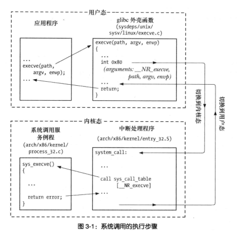
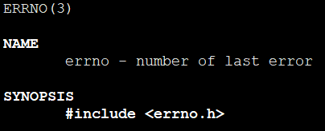
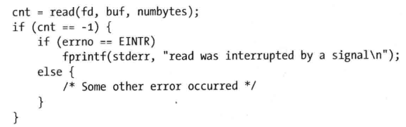
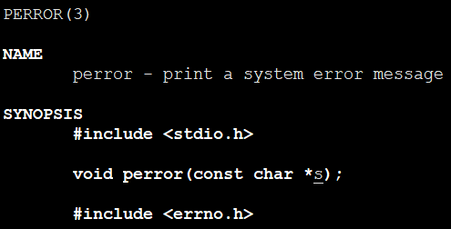

# 系统调用

## 总结

1. init 0x80 中断调用 和 systenter指令
2. 执行结果返回两次，errno和返回值。
3. 每个系统调用编号固定统一，固定通过eax寄存器传递调用编号
4. 无论何时执行系统调用或者库函数，检查返回状态以确定调用是否成功是良好编程习惯
5. 系统调用man手册在第二章，例如man 2 read
6. 系统调用参数传递仅通过堆栈
7. 库函数->系统调用->中断处理程序->系统调用服务例程
8. 存在绝对会成功的系统调用
9. 系统调用失败时会设定全局整型变量errno为一个正数值，用来标记具体错误。头文件<errno.h>

10. errno只在失败的时候有效，但是**执行成功时候不会将errno置0**。因此调用后检查必须先判断返回值在判断errno。当然也可以调用前置0，调用后进行检查。因为**存在执行成功返回-1的系统调用**。

11. perror输出到STDERR，普通printf输出到STDIN
12. strerror- return string describing error number - 返回给定errno编号相应错误字符串信息
13. strerror和perror都是环境敏感，执行时会使用本地语言。
14. 库函数执行返回包括多种情况。
  A. 错误返回-1，errno设定
  B. 错误返回非-1，errno设定
  c. 不设定errno
15. 分区选项和参数
